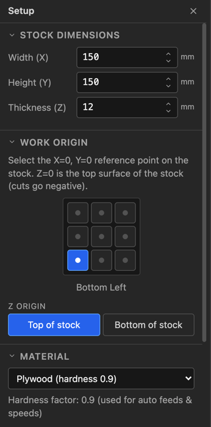

# 3. Stock, origin and tools

Two things have to be true before a toolpath means anything: the app has to know what is
on your table, and it has to know what is in your spindle. Get these right once at the
start of a project and everything downstream — depths, the simulation, the feeds, the
warnings at export — follows from them.

---

## Setup: the stock

**Setup** is the third tab in the sidebar. It fills the panel and leaves the view
visible, so edits show up live.

### Dimensions

**Width (X)**, **Height (Y)** and **Thickness (Z)** are the actual piece of material.
Thickness is the one that does real work: a profile cut to 12 mm through 12 mm stock is
what separates the part, and the simulation carves a block of exactly this depth.

### Work origin

Two separate questions, and both matter more than they look.

**X0 Y0** is the nine-position grid — which corner or edge of the stock the machine's
zero corresponds to. **Bottom left** is the default and is what most hobby machines get
jogged to. Pick centre if you locate work from the middle, which is common with a
fixture or a rotary axis.

**Z0** is where the tool's zero height is:

| Setting | Means | Zero the bit against |
|---|---|---|
| **Top of stock** (default) | Z0 is the surface; all cuts are negative | The top of the material |
| **Bottom of stock** | Z0 is the spoilboard; the surface is at +thickness | The table or spoilboard |

Top of stock is the usual choice — you touch off on the workpiece with a piece of paper
or a Z-probe and go. Bottom of stock suits work where the material thickness varies but
the finished depth from the table must not, such as surfacing a slab.

Whichever you choose, **the export review restates it back to you** before the file is
written. Read that line against how you actually zeroed the machine. Getting this wrong
is the fastest way to plunge a cutter through a spoilboard.

### Material

The material is not decoration. Each has a **hardness factor** that drives the automatic
feeds and speeds:

| Softer ← | | | | → Harder |
|---|---|---|---|---|
| Cedar 0.5 · Pine 0.6 | HDPE 0.7 · MDF 0.8 · Plywood 0.9 | Walnut 1.1 · Cherry 1.2 | Maple 1.3 · Oak 1.4 | Aluminum 2.5 · Brass 2.8 |

Aluminium and brass additionally carry a **maximum surface speed**, because the failure
mode in metal is not a broken cutter but a bit that overheats and welds swarf to its own
edge. If your spindle cannot run slow enough to respect it, the export review says so.

---

## The tool library

The **Tool Library** tab across the top holds your cutters. It is saved with the project
*and* kept in the browser between sessions, so a new project starts with the tools you
already own.

<!-- FULL APP · 1589 px wide, a 1× capture of a window wide enough for the whole table (the Tool Library needs ~1560 px with the Dial column; at 1400 it scrolls sideways). Not upscaled. Tool Library tab, the IDC Woodcraft catalogue in its own folder, sorted by type. -->

### Folders

The library is split into **folders**, shown as tabs above the table. **My Tools** is your
own rack — the cutters you actually own — and is always there. Every other folder is a
tool set you **imported**, and an import always lands in a folder of its own, so a vendor's
80-bit catalogue never mixes in with, renames, or overwrites the tools you set up yourself.
The number on each tab is how many tools it holds; click a tab to show its tools.

- **Rename** a folder by double-clicking its tab.
- **Delete** a folder with the **×** on its tab (or **Delete folder** at the right of the
  bar). The dialog lists what goes, and keeps any tool the open project cuts with. My Tools
  can't be deleted.
- **Move** a tool to another folder with the folder icon in its row's **Actions** — pick a
  folder, or **New folder…** to make one. The tool keeps its identity, so toolpaths that
  use it are unaffected.
- **Copy to My Tools** (the copy icon, in an imported folder's rows) adds the bit to your
  own rack and leaves the folder as the vendor published it. This is how a catalogue bit
  you've bought becomes one of yours.

**Add Tool** adds to the folder you're looking at, and **Export** saves *that folder* as a
`.fkset` file to share. (The whole library, every folder, goes out with Setup's
**Export** — see [settings files](#your-settings-in-a-file).)

### Importing a tool set

**Import** reads two kinds of file:

- a FreazyKam **`.fkset`** — a tool set a friend exported, or one of your own from another
  computer;
- a **Fusion 360 tool library** (`.json`) — the format most bit makers publish their
  catalogue in. Look on the maker's website for a *Fusion 360* download.

A dialog asks **which folder** the tools go into — the maker's name by default (*IDC
Woodcraft*), or the file's name — and lists what will be added before anything changes.
Pick an existing folder to bring a catalogue up to date: tools already there exactly are
skipped, and a changed one comes in beside the old as *"Name (imported)"*, so importing
the same file twice adds nothing. Your own tools are never touched. Typing *My Tools* as
the folder is the one way to import straight into your rack.

From a Fusion 360 library, FreazyKam takes each bit's type, diameter, flutes, flute
length, and the maker's starting **RPM, feed and plunge**, converted to millimetres. A few
things are worth knowing:

- **Bits FreazyKam can't model are left out, and listed.** Round-over (radius) bits are the
  usual ones — the dialog names each one and why.
- **A bull-nose or bowl bit comes in as a Bull Nose**, keeping its corner radius.
- **A V-bit's Max Z is worked out from its cone**, not copied from the file — catalogues
  often get the flute length wrong (one lists a ½" 90° V-bit as 1.7 mm deep when its cone is
  6.35 mm).
- **A taper's angle comes in per side, and its Ø is the tip** — the same conventions the
  library uses ([below](#the-two-angle-conventions)).
- **The maker's chip load comes in as the bit's rating,** in the **Chip** column — see
  [below](#the-rated-chip-load).

**Restore Defaults** puts back the tools FreazyKam comes with **in My Tools** — imported
folders are not touched. It first lists what will be removed, which default tools come
back, and which of yours are **kept because the open project cuts with them** — an
operation names its tool, so those stay, or its toolpath would lose its cutter. It can't
be undone with Undo, so the dialog offers **Export a backup**.

### The table

Each row is one cutter. The little picture at the left is drawn from that tool's own
numbers, so a taper really does taper and a V-bit really does come to a point — a quick
check that a row says what you meant.

| Column | Means |
|---|---|
| **Name** | Yours to choose. Name them the way you'd reach for them in the shop |
| **Type** | End Mill, Bull Nose, Ball Nose, V-bit, Taper End Mill, Drill — this decides which operations offer it |
| **Ø** | Cutting diameter — **except on a taper**, where it is the *tip* diameter |
| **Flutes** | With RPM and feed, this sets chip load |
| **Chip** | The bit's **rated chip load** per tooth — the maker's recommendation. Fixed: the feeds are checked against it. Blank for no rating ([below](#the-rated-chip-load)) |
| **RPM** | Spindle speed |
| **Dial** | The router's speed dial setting for that RPM — shown only when Setup names a trim router with a dial ([Spindle](#spindle)) |
| **XY Feed** | Cutting feed |
| **Z Feed** | Plunge feed — always slower; a cutter plunging is cutting with its worst geometry |
| **Max Z** | Deepest this tool may cut, i.e. its usable flute length |
| **Angle° / R** | V-bits: the **included** angle. Tapers: the angle **per side**. Bull noses: the **corner radius**. Hover the field to see which. A dash for everything else |
| **Actions** | Shown when you hover a row — in the picture above, the row for THE "RIPPER" 1/2" Hogging Upcut: **move** to another folder (the folder-with-arrow icon), **copy to My Tools** (the copy icon, imported folders only) and **delete** (the bin) |

### Type decides where a tool can be used

| Tool | Offered to |
|---|---|
| End mill | Profile, Pocket, Trochoidal, Surface, Inlay (roughing and finishing), peck and helical drilling, 3D Profile (roughing), Nest's Shared lines |
| Bull nose | Profile, Pocket, Trochoidal, peck drilling, 3D Profile (finishing and roughing) |
| Ball nose | Profile, Pocket, Trochoidal, peck drilling, 3D Profile (finishing and roughing) |
| V-bit | Profile, V-Carve, Photo V-Carve, Inlay walls, peck drilling |
| Taper end mill | Profile, V-Carve, Inlay walls, 3D Profile (finishing), peck drilling |
| Drill | Peck drilling |

Peck drilling lists every tool, since anything can plunge — but it warns for an end mill
(it must be centre-cutting), a ball nose (round-bottomed hole) and a taper (a cone).
Surface offers end mills only.

If a cutter you expected isn't in an operation's list, it is the wrong **type** for that
operation. Max Z does not hide a tool — ask for more depth than it has and the depth
field warns *Exceeds tool Max Z*, leaving the decision to you.

### Bull nose and bowl bits

A **bull nose** has a flat bottom whose edge is rounded into the side by a **corner
radius**, R in the Angle° / R column. A bowl bit is a bull nose with a big corner: the 1"
IDC bowl bit has a ⅜" corner, so only the middle ¼" of its bottom is flat. Set R to 0 and it
cuts like an end mill; set it to half the diameter and it is a ball nose. When you switch a
tool to Bull Nose, R starts at a quarter of its diameter.

It is offered wherever a flat-bottomed or round-bottomed cutter is: Profile, Pocket,
Trochoidal, and 3D Profile for finishing or roughing. Two things to know:

- **In a pocket, keep the stepover under the flat width** (Ø − 2 × R). The passes are
  spaced as if the whole diameter were flat, so a wider step leaves low ridges between
  them — about 0.2 mm on the bowl bit at a 0.4" step.
- **In 3D Profile it is modelled exactly**, flat and corner, so it never cuts into the
  model. It works the model out on a finer grid when the corner is small, which makes a
  small-cornered bull nose slower to generate than a ball nose of the same size.

### The two angle conventions

This trips people up because the trade itself is inconsistent, and the library follows
the trade rather than tidying it up:

- A **V-bit's** angle is the **included** angle — the whole opening. A 60° V-bit has 30°
  on each side of the axis.
- A **taper end mill's** angle is **per side**, which is how the bits are sold.

And a taper's diameter column is its **tip**, not what it cuts. Its widest cut comes from
the tip, the angle and Max Z together: a 5°/side taper on a 2 mm tip with 20 mm of taper
cuts Ø5.33 mm at full depth, and its included angle is 10°, for comparison against a
V-bit.

The practical difference is at the bottom of a cut. A taper's tip is a small ball, so it
can enter a groove narrower than itself and leave a round-bottomed cut instead of refusing
the job — which is what makes it good for fine lettering and 3D finishing. A V-bit comes
to a true point and closes tighter, which is why an inlay still wants one: a taper's
rounded foot leaves a hairline gap at the finished face.

---

## Feeds and speeds

The bottom of the Setup panel decides how hard the machine is driven. **Auto Feeds &
Speeds** is on by default, and it is the right default: it computes a feed, plunge feed,
spindle speed and step-down per operation, from the tool, the material and your machine.

### How the chip load is chosen

The **chip load** is how thick a bite each tooth takes: feed ÷ (RPM × flutes). Auto Feeds
picks it first and sets everything else around it. It depends on **both the material and
the bit**:

- **The material** sets the scale. Pine takes a thicker chip than maple, and aluminium a
  far thinner one.
- **The bit's size** scales it. From 1/8" up the chip grows in step with the diameter (up
  to twice a 6 mm bit's). **Below 1/8" it shrinks faster than the bit does**, because a
  small bit is weaker for its size. A 1/16" bit takes about a third of a 1/8"'s chip, not
  half. Without that, a 1/32" engraving bit gets fed hard enough to snap.
- **The bit's type** adjusts it. A V-bit's point is fragile; a ball nose and bull nose cut
  with less of their edge.
- **The bit's rated chip load** (the **Chip** column) sets a ceiling: the chip never goes
  above it, whatever the material would take.

Your machine then trims it (rigidity, below), and the spindle speed is chosen so the
feed your machine can manage still delivers that chip.

### The rated chip load

Every bit has a **Chip** column in the library: its **rated chip load**, the bite per tooth
its maker recommends. It's a fixed property of the bit. The feed, RPM and flutes are what
you set; the chip check judges them against this rating.

- **Where it comes from.** An imported bit carries its maker's figure. The factory tools
  are rated from their IDC-matched numbers. Tools from before the column existed were rated
  once from their own feed, RPM and flutes. **Add Tool** copies the selected row's rating
  along with everything else. A drill has none, since it plunges rather than side-cuts.
- **Editing the feed, RPM or flutes never changes it.** That's the point: if you set an
  RPM or feed that runs the bit too hot or too cold for its rating, the export review and
  the simulator's chip-load gauge say so — with Auto Feeds on or off.
- **With Auto Feeds on**, each cut aims for the lower of the rating and what the material
  and bit size call for, so it never feeds a bit harder than its rating.
- **Making your own tool:** type the rating from the maker's chart, or copy it from a
  similar bit, then set the feed and RPM you want; the check still has something to judge
  them by. Clear the field for no rating, and the material-and-size model is the only
  reference.

### Machine rigidity

The single most useful number here. It scales both how hard the app drives the chip and
how deep a pass it takes:

| | Level | Suits |
|---|---|---|
| 🐌 | 1 · Hobby (light gantry) | Light rail or 3D-printed frames, belt drive, small routers |
| 🐢 | 2 · Light hobby | An entry aluminium-extrusion machine |
| 🐇 | 3 · Prosumer | A stiff hobby machine — the default |
| ⚡ | 4 · Heavy / industrial | Steel frame, ballscrews, a real spindle |
| 🚀 | 5 · Commercial CNC | Industrial machine |

Set it honestly. Too high and a flexy gantry chatters, deflects and leaves a wandering
wall; too low and you spend hours cutting air-light passes. The status bar shows the icon
at all times so an over-ambitious setting reads "hot" at a glance.

### Spindle

Set **Min Spindle** and **Max Spindle** to what your spindle can actually do — routers bottom out
around 10 000. Auto mode picks a speed inside that range.

Then pick your spindle type under **Spindle / Router**. If you run a trim router rather than a VFD spindle, this
is worth setting: the app knows the published speed charts for the **DeWalt DW6xx /
DWP611** and the **Makita RT07 / RT0701C**, and translates every RPM into **the dial
number you actually turn** — `dial 2`, `dial 2.5` — shown in the tool table, the
simulation and the G-code comments. G-code `S18000` is no use if your router has no idea
what an S-word is.

### Max feed rate

**Max Feed Rate**, under Machine Motion, is a hard ceiling, in mm/min. Set it to what your machine can move without losing steps, and
the app will not exceed it.

This one has a consequence worth understanding. Chip load is feed ÷ (RPM × flutes), and
it does **not** depend on how deep the pass is. So when the machine cannot feed fast
enough to reach a sensible chip load, the correct fix is to **slow the spindle down**, not
to take a shallower cut — and that is what the app does. A bit that is fed too slowly for
its speed doesn't cut; it rubs, heats and dulls.

### The chip-load gauge

Whether the numbers are right is answered while the simulation runs, in the readout under
the stock:

| Reading | Ratio to target | Means |
|---|---|---|
| 🔴 **rubbing · too hot** | below 0.75 | Feed too slow for the RPM — the edge rubs instead of cutting |
| 🟢 **sweet spot** | 0.75 – 1.4 | Where you want to be |
| 🔵 **chips too large** | above 1.4 | Feed too fast for the RPM — risk of breaking the cutter |

On manual feeds the app also suggests the feed that would put you back in the band. This
is the honest check on everything in this chapter: set the stock, set the tools, then
watch the gauge on a simulated run before you cut anything.

> The model produces **sane starting numbers, not shop-certified values.** It knows your
> tool, your material and how stiff you said your machine is; it does not know your
> cutter is dull, your stock is a knotty board, or your workholding is a bit optimistic.
> Treat its output the way you'd treat a manufacturer's chart — a place to start.

---

## Your settings in a file

**Setup → Settings File** saves everything this browser keeps for you — machine, tool
library, post-processors, last-used form values, the Machine tab's settings and interface
choices — as one `.fkset` file. Use it to move to another computer or browser, to keep a
backup, or to send along with a problem report.

**Import…** shows what's in the file, a checkbox per part, before anything changes:

- **Tools** and **post-processors** are *added* to yours by default — each row says how many
  are already in yours and how many it would add. One with the same name as yours but
  different contents comes in as a copy, *"Name (imported)"*; an identical one is skipped.
  Switch a row to **Replace** to swap yours for the file's instead — the way to move your own
  setup to a new browser without ending up with two sets. Tools the open project uses are
  kept either way.
- **Machine**, **stock defaults**, **last-used form values** (the settings each form opens
  with — every Generate remembers them), **Machine tab** and **interface** *replace*
  yours, so they start unticked — tick them when restoring your own backup, leave them
  when the file came from someone else.

Any replace turns the button red (*Import and replace*) and offers **Export a backup**
first: settings aren't covered by Undo.

**Restore default machine settings…** puts the machine limits, feeds & speeds, motion and
spindle back to how they came, after listing every setting that changes (*Max feed: 4321 →
3000 mm/min*). The stock, your tools and your post-processors aren't touched.

A project file (`.fkam`) is not a settings file: opening a project only ever loads the
drawing and the tools it uses, never someone else's machine settings.

---

## Next

- **[4. Operations](04-operations.md)** — turning geometry into toolpaths
- **[5. Profiles and pockets](05-pockets.md)** — cut side, tabs, and the five pocket strategies
