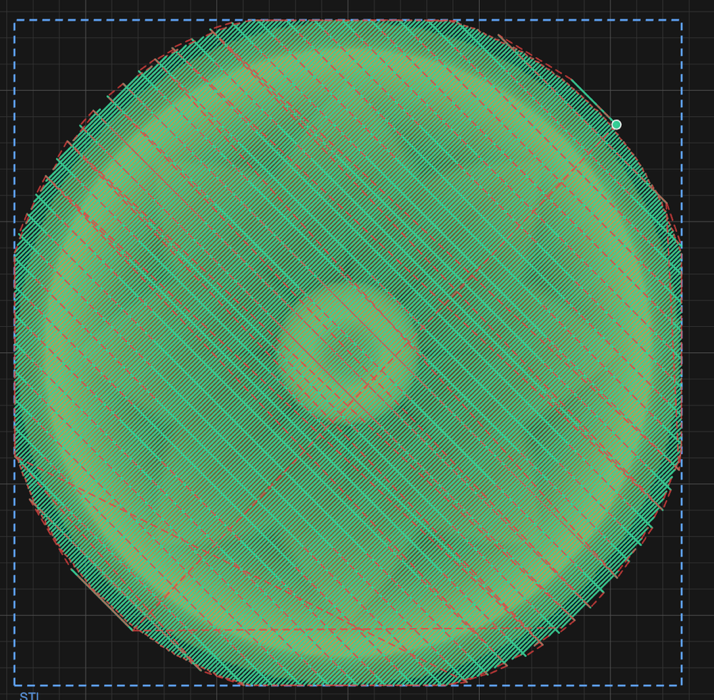
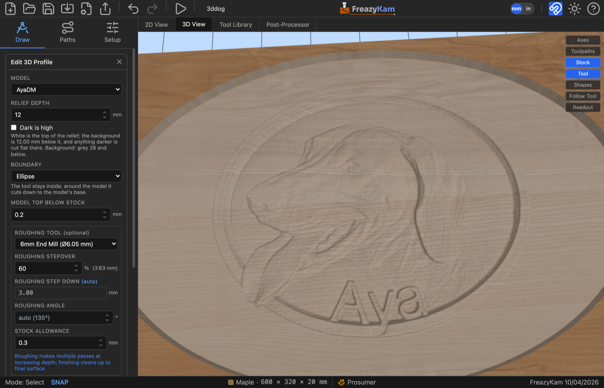
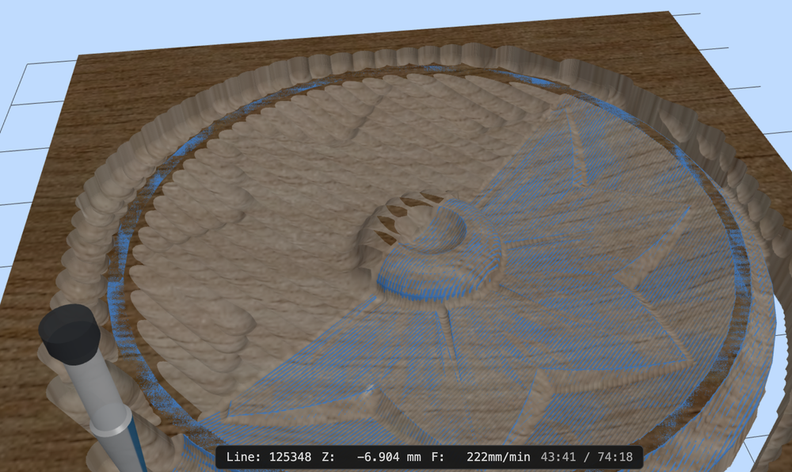

# 7. 3D work

Everything so far has cut 2D geometry to a depth. **3D Profile** is different: it follows
a surface, taking its shape from an imported STL mesh or a greyscale **depth map** image,
and sweeping a round-nosed cutter back and forth across it until the wood matches the
model.

This is how you carve a relief — a sign with a raised crest, a topographic map, a face,
anything modelled elsewhere.

---

## Importing an STL

**Import File** in the toolbar takes `.stl` in both binary and ASCII form. Drag-and-drop
onto the canvas works too.

What appears on the canvas is a **rectangle**, not a mesh — the model's XY footprint at
its true size, placed in the middle of the stock. The mesh itself rides along with that
rectangle; the rectangle is the handle you use to place and size the carve.

Switch to the **3D View** to see the actual model.

### Placing and sizing it

Move and scale the rectangle like any other object ([chapter 2](02-canvas.md#moving-scaling-and-rotating)).
Two things about how that maps onto the carve:

**The top of the model becomes the top of the stock.** The mesh's highest point is placed
at Z 0 and everything else hangs below it, so the whole relief cuts *into* the board. You
don't position it in Z; you decide how deep you'll let it go.

**Depth scales with the average of the X and Y scaling.** Scale the rectangle uniformly
and the relief keeps its proportions — twice as wide is twice as deep. Scale it
non-uniformly and the height is scaled by the mean of the two, which will not match either
axis, so a stretched model is a distorted one. If you care about the proportions, scale
uniformly.

> An STL is a **surface**, and this operation carves it from directly above. Undercuts —
> anything that overhangs itself — cannot be machined on three axes, and the carve simply
> takes the highest surface at each point. Model accordingly.

---

## Importing a depth map image

A depth map is a greyscale picture in which **brightness is height**: white is the top of
the relief, black is the bottom, and every grey is somewhere between. They are the common
currency of relief carving — sold as "grayscale reliefs", exported from 3D modelling
programs, or generated from an ordinary photo by depth-estimation tools. If you have one,
you do not need an STL.

**Import File** takes PNG, JPEG and WebP. The picture appears on the canvas at its true
aspect ratio, and you move, scale and rotate it like any other object. Two differences from
an STL:

**Width, height and depth are independent.** The rectangle sets the carve's width and
height exactly; its depth is a setting on the operation (*Relief Depth*, below), not a
consequence of the scaling. Stretching a picture does not distort its depth the way
stretching an STL does.

**Rotation is followed exactly.** A turned picture carves turned, where the canvas shows it.

> Prefer **PNG**. JPEG compression scatters faint specks through a flat background, and
> while the carve recognises a background and cuts it flat (see below), a clean source is
> always the better start.

---

## The 3D Profile operation

Choose **3D Profile**, then pick the model from **Model**: STLs and images are listed
separately, under *STL* and *Depth map image*. The form has two halves.

### Finishing — the pass that makes the surface

| Field | What it does |
|---|---|
| **Tool** | **Ball nose or taper only.** A flat cutter cannot follow a curved surface |
| **Stepover (XY)** | Spacing between passes, as a percentage of tool diameter |
| **Angle** | Which way the raster lines run, −90° to +90° |
| **Max Depth** | How far below the stock top the cut may go |

**Stepover is the finish quality control, and it is the expensive one.** The cutter is
round, so between two adjacent passes it leaves a ridge — a *scallop*. Halving the
stepover halves the scallop height and doubles the number of passes, and 3D finishing
passes are long to begin with. A small ball nose at a fine stepover can run for hours.

> **On a taper, stepover is a percentage of the tip, not of the cutting diameter.** A 30%
> stepover on a 2 mm tip is 0.6 mm — the form spells the millimetres out beside the
> percentage, which is the number to judge.

Pick the **angle** to run the passes along the length of the detail rather than across
it — a face reads better rastered vertically, a long ridge along its own axis.

### Roughing — the pass that saves the finishing cutter

Optional but almost always worth it. Without it, the finishing tool has to remove
everything, taking full-depth cuts with a small round bit — slow, and hard on the cutter.

| Field | What it does |
|---|---|
| **Roughing tool** | A bigger **ball nose** or a **flat end mill**. An end mill takes level ground — the floor round a relief — straight to its final depth, leaving the finish nothing to do there. *None* gives a single-pass job |
| **Roughing stepover** | Wider than the finishing stepover — this pass is for volume, not finish |
| **Roughing step down** | Axial depth per level |
| **Roughing angle** | Defaults to 90° from the finishing angle, so the finish pass crosses the roughing marks |
| **Stock allowance** | Material left for the finishing pass — 0.3 mm by default |

The finishing pass is **rest-machined**: it knows what roughing already removed and only
cuts what's left, so it doesn't waste time cutting air over ground that's already clear.

*Both passes drawn together. Finishing is set to 45°, so roughing defaults to 135° and the
two cross at a right angle — finishing across the roughing grooves cuts a more even chip
than following them.*

<!-- CROP · canvas region from a 2× capture, downscaled to 714 px wide (capped at 700 px tall). -->

### A depth map's height

Pick an image as the model and two fields appear under it:

| Field | What it does |
|---|---|
| **Relief Depth** | How far the picture's background lies below its white — the height of the carve |
| **Dark is high** | Turns the picture over: black becomes the top and the lightest part the bottom |

**White sits at the top of the stock** — or *Model Top Below Stock* lower, if you set it —
and the **background** sits Relief Depth below that. The greys in between are spread evenly
across the depth.

**The background is found, not assumed.** A depth map's background is rarely pure black:
it may be a dark grey, and a JPEG's black is a dense cluster near 0 with compression
specks scattered out to grey 20 or more. Taking black as the bottom would leave a grey
background standing proud of the floor cleared round the picture, and would carve every
speck as a bump. So the carve finds the background as the cluster of near-identical darks
at the bottom of the picture's tones, takes in its specks, and cuts everything at or
darker than it **flat on the floor**. The form shows where it landed — *Background: grey 28
and below* — so you can check it before generating. A picture with no flat background, only
content, uses its darkest tones, ignoring the darkest 0.1 % so a few specks cannot decide it.
With *Dark is high* all of this is mirrored: the background is the light cluster at the top.

Two things to keep in mind:

- **A picture has 256 grey levels**, so the height comes in up to 256 steps. On a 12 mm
  relief each step is under 0.05 mm, finer than a ball nose's scallops — but a picture that
  uses only a narrow band of greys has fewer steps than that across the same depth.
- **Max Depth still caps the cut.** If Model Top Below Stock plus Relief Depth goes deeper
  than Max Depth, the lowest part of the picture is cut flat at Max Depth, and the form
  says so under Relief Depth.

A depth map is finished with the **Raster** strategy only; *Waterline* is not offered for
an image.

### Clearing round it

With **Boundary** left at *Model box*, the carve covers the picture's own rectangle and
nothing else. Draw a closed shape round the picture and pick it as the Boundary instead,
and everything inside that shape which the picture does not cover is cleared down to the
background level — the picture stands as a relief in a recessed field, with the tool's edge
kept inside your shape. Pick *Stock* to clear to the board's own edges.

Around a boundary the finish does not visit ground the roughing has already finished: each
raster row turns round where the relief's work ends, and one lap of the boundary at the end
cleans the edge.

---

## Example — a depth-map plaque

*A greyscale depth map of a dog plaque, carved into maple. The picture is the model, an
ellipse drawn round it is the boundary, so the field around the plaque is cleared down to
its background. Settings: Relief Depth 12 mm with the background found at grey 28, Model
Top Below Stock 0.2 mm so the plaque's rim is skimmed rather than left as raw stock, a 6 mm
end mill roughing at 60 % stepover, and a 1/8" ball nose finishing at 20 % (0.64 mm) on a
45° raster.*

<!-- FULL APP · 1600 px wide, downscaled from the 2800 px capture. 3D view after the
simulation, Readout off; Edit 3D Profile form open in the sidebar. -->

The order of work for a job like this:

1. **Import the picture** and size it on the stock. Scale it uniformly unless you mean to
   change its proportions.
2. **Draw the boundary** — here an ellipse — enclosing the whole picture.
3. **3D Profile**: pick the picture as the Model and the ellipse as the Boundary, set Relief
   Depth, and check the *Background* readout under it.
4. **Add an end mill as the roughing tool.** On a plaque most of the volume is the open
   field, which the end mill clears to its finished depth outright.
5. **Generate, then simulate** in the 3D view before trusting it.

---

## Checking it

The **3D View** is not optional on this kind of job. A relief has no outline to sanity-check
on the 2D canvas; the toolpath is thousands of near-identical passes and reading it tells
you nothing.

*Part way through a relief. The ridges around the rim are roughing scallops the finishing
pass hasn't reached yet — and the clock says 43:41 of 74:18.*

<!-- CROP · canvas region from a 2× capture, 1000 px wide. -->

Simulate, then look at the carved surface. What you are checking for:

- **Scalloping** you can see in the render will be there in the wood.
- **Flat spots** where the tool was too big to reach into a hollow. A ball nose cannot cut
  a valley tighter than its own radius, and the simulation shows exactly that.
- **A relief that bottoms out**, meaning Max Depth clipped the model rather than the model
  fitting the board.

And check the estimated run time in the export review before committing. 3D finishing is
where a job quietly turns into an overnight one.

---

## Next

- **[8. Parametric parts](08-parts.md)** — gears, clocks, track and cutting boards
- **[10. Simulating and exporting](10-export.md)** — the review before you cut
