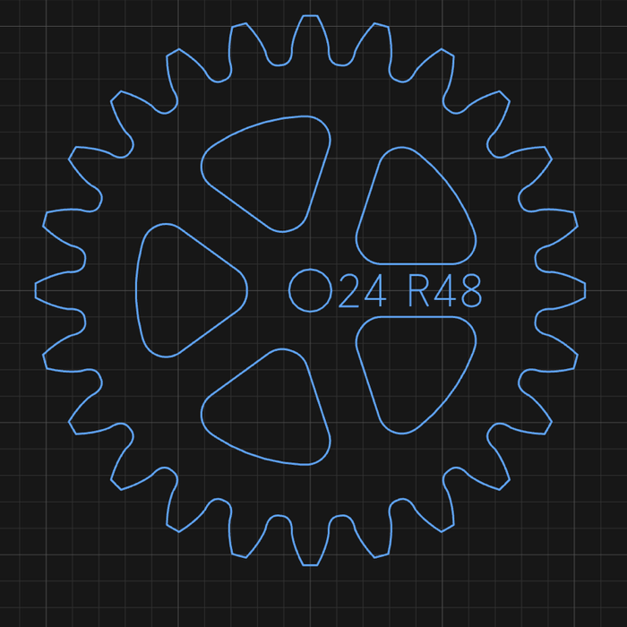
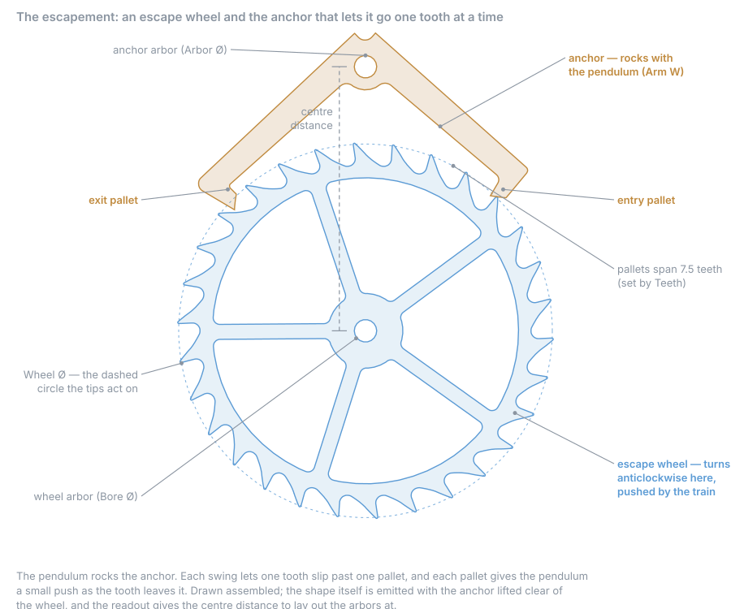
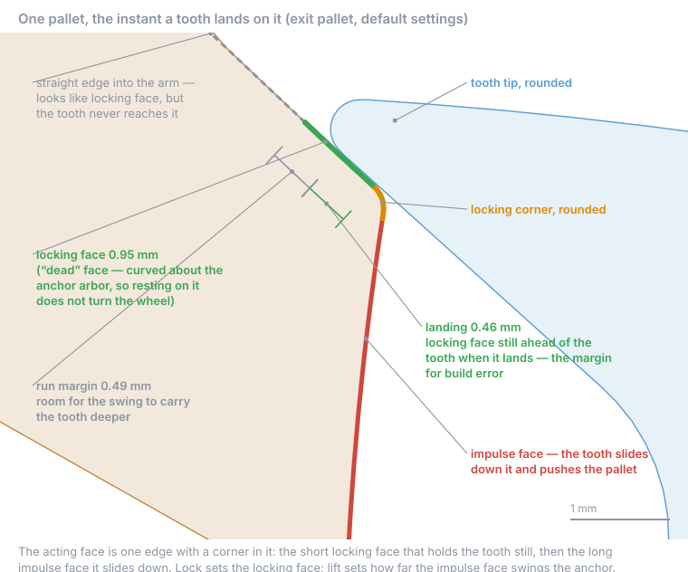
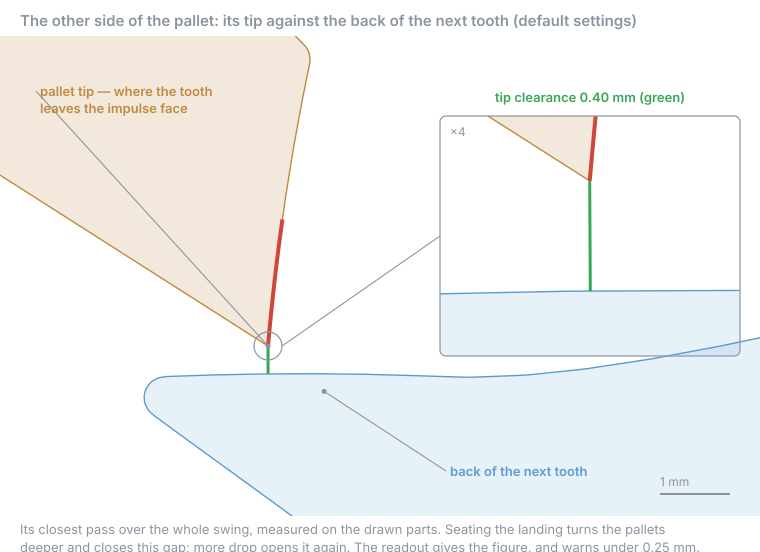
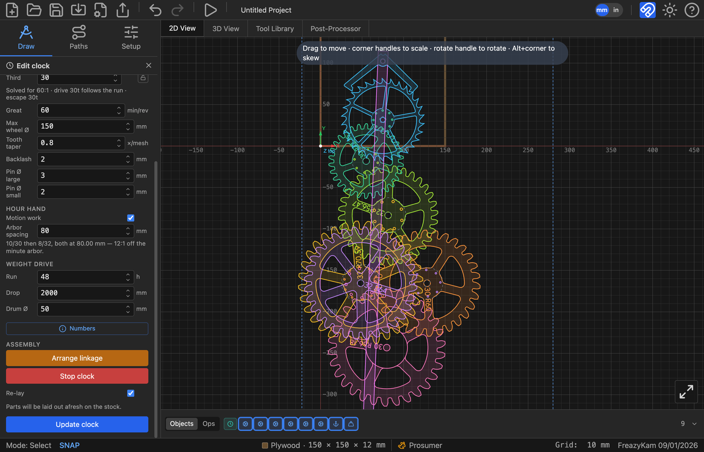
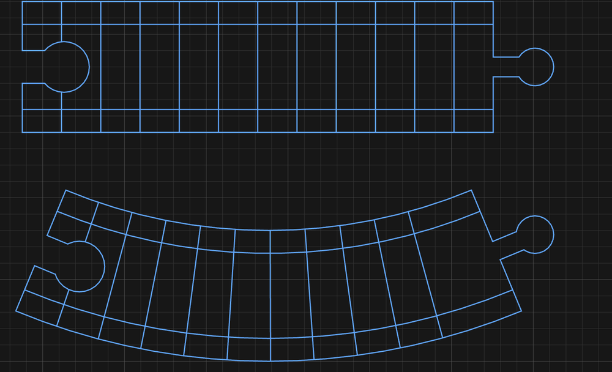
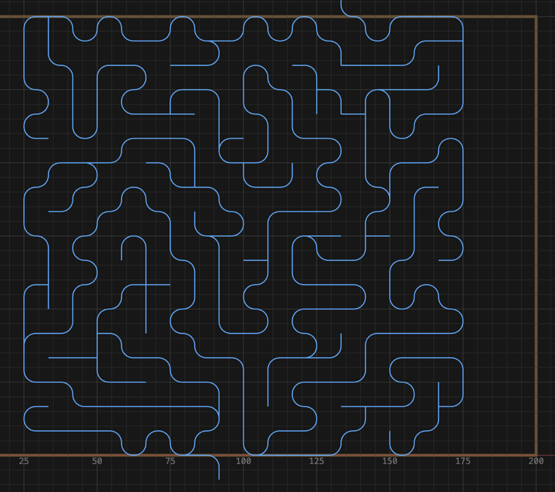
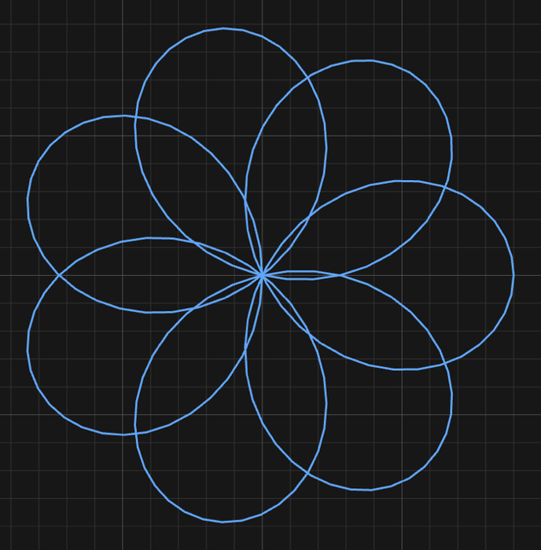

# 8. Parametric parts

Most of the shape picker draws outlines. The bottom two rows make **parts** — a gear
with a real involute profile, an escapement whose pallets are derived from its own wheel,
a track piece that fits commercial track. They are working mechanisms described by their
engineering parameters, not pictures of mechanisms.

Three things are true of all of them:

- **They stay editable.** Every one keeps its parameters and reopens from its chip in the
  Objects strip. Change the tooth count and the gear is recut.
- **Some refuse drag-sizing.** Gear, escapement, pendulum and track are placed at the size
  their parameters give them, and draw no resize handles. A gear's size comes from module
  and tooth count; dragging cannot make one that meshes wrong.
- **Some are not outlines**, and want a particular cutter. The maze and the cutting board
  are covered below — read those before cutting one.

---

## Gear

Module × tooth count, with a **true involute profile** — the curve that makes a gear pair
transmit motion at constant ratio, rather than a rounded-tooth shape that looks like one.

| Field | Meaning |
|---|---|
| **Mod** | Module — tooth size. Pitch diameter = module × teeth |
| **N** | Tooth count |
| **Prf** | **Involute** for general work, **cycloidal** for clocks |
| **PA** | Pressure angle (involute) |
| **Pin** | Mating lantern pinion's pin count (cycloidal) |
| **Back** | Backlash — play between the flanks |
| Bore, hub, spokes | The wheel body |

The root is cut as a **hobbed trochoid** — the shape an actual hob would leave — so gears
below the classic minimum tooth count come out **undercut**, exactly as they would in
steel. A 10-tooth involute pinion is a real 10-tooth pinion with the thin roots that
implies, not an idealised drawing that would bind against its mate.

**The tooth count and pitch radius are engraved on the face.** Cut a set and you can still
tell them apart on the bench a year later.

*A 24-tooth gear at module 4, engraved `⊙24 R48` — its tooth count and pitch radius. The
panel beside it reports pitch, base, outside and root diameters, the centre distance it
meshes at, and the play at the mesh.*

<!-- CROP · canvas region from a 2× capture, downscaled to 700 px wide/tall. -->

**Cycloidal gears emit their mating lantern pinion too** — a pinion of pins rather than
teeth, which is how clocks are built. The two are generated together because a cycloidal
wheel's face is the epicycloid of *that* pinion's pin circle: they only mean anything as a
pair.

**Either can be animated in mesh** from the panel, which runs the pair on the canvas so
you can see that they actually turn together before you cut them.

---

## Escapement

Deadbeat or recoil. The **wheel and anchor are generated together from one spec**, and
this is not a convenience — the pallet faces are loci of *this* wheel's tooth tips. An
anchor from one escapement and a wheel from another do not make an escapement.

It animates through its beat, which is the only sensible way to check one: watch a tooth
land on a locking face, the pallet lift, and the next tooth drop.

### How it works

The train pushes the escape wheel round, and the anchor, rocked by the pendulum, stops it.
Each beat goes through four steps:

1. **Lock.** A tooth rests on a pallet's **locking face**. That face is an arc about the
   anchor's arbor, so as the pendulum swings on, the pallet slides under the tooth without
   turning the wheel. That's what makes a **deadbeat** dead.
2. **Unlock.** The pendulum swings back far enough for the tooth to reach the corner at the
   end of the locking face.
3. **Impulse.** The tooth slides down the sloping **impulse face** and pushes the pallet
   out of its way. That push is what keeps the pendulum swinging.
4. **Drop.** The tooth leaves the pallet's tip and the wheel turns freely for a moment,
   until a tooth lands on the *other* pallet's locking face. Then the whole thing runs in
   reverse.

One beat moves the wheel half a tooth. Two beats, one out and one back, move it a whole
tooth.

A **recoil** escapement has no locking face. Its tooth lands straight on a sloping face,
and the pendulum's extra swing pushes the wheel backwards a little. That's the "tick-tock
with a shudder" of a long-case clock's second hand.

### The fields

| Field | Meaning |
|---|---|
| **Type** | **Deadbeat** (Graham) — the tooth rests dead still while locked; the better timekeeper. **Recoil** — no locking face; simpler, more forgiving, a little less accurate |
| **Teeth** | Tooth count. **30** beats seconds with a one-second pendulum. Also sets how many teeth the pallets **span**, which fixes the shape of the anchor |
| **Wheel Ø** | The circle the tooth tips act on (dashed above). The tips are rounded and their material stands one round proud of it, so the wheel measures slightly more across the teeth — the readout gives both |
| **Tooth H** | Tooth depth, tip to root. Deeper teeth leave more room for the pallets to dive into |
| **Drop** | Degrees the **wheel** turns freely between one tooth leaving a pallet and the next landing. Taken out of the half tooth each beat moves the wheel; what is left is the impulse. More drop gives the pallet tip more room, and throws more of the drive away |
| **Lift** | Degrees the **anchor** swings while a tooth slides down the impulse face — the impulse, measured at the pendulum. More lift turns the impulse faces away from the wheel's rim, so the tooth pushes the pallet instead of mostly sliding along it |
| **Lock** | Deadbeat only. Degrees the anchor swings with a tooth resting on the locking face. It sets how long the locking face is, and so how much margin a tooth has when it lands (see below) |
| **Draw** | Deadbeat only. Degrees the locking face leans off a true arc, so the wheel's own push pulls the pallet *in* and holds the lock, rather than nudging it out. Keep a degree or two |
| **Recoil** | Recoil only. Degrees of extra swing the faces can take, driving the wheel back as they do |
| **Arm W** | Width of the anchor's arms and pallets |
| **Bore Ø / Hub Ø / Spokes** | The wheel's arbor hole and body, as on a gear |
| **Arbor Ø** | The anchor's arbor hole |
| **Clockwise** | Which way the wheel turns. The teeth lean the way it runs, so this is geometry, not a view option — a wheel cut the wrong way round will not lock |

Drop is measured at the **wheel** and lift at the **anchor**. They aren't the same angle
measured twice.

### The locking face and the landing

The acting face of a pallet is **one edge with a corner in it**. The corner is rounded,
and so is the tooth's tip. What matters is where the tooth lands along the locking face:

- **Landing** — how much locking face is still ahead of the tooth, up to the corner, at the
  instant it lands. **This is the margin every build error spends.** A centre distance built
  long costs about 0.7 mm of it per mm. Tips cut short, slop in the pivots and a corner
  worn by the landing tooth spend it too. When it runs out the tooth lands on the impulse
  face, which doesn't hold it, and the wheel runs through. The target is **0.5 mm**.
- **Run margin** — the locking face beyond the landing, kept for the pendulum's extra
  swing to carry the tooth deeper. The generator always keeps 0.5 mm of it.

**More lock means a longer locking face**, and the extra goes into the landing until it
reaches 0.5 mm. After that it only lengthens the run margin. The readout tells you the lock
that seats the full 0.5 mm: as a note while the landing is still 0.25 mm or more, and as a
warning under that.

**Why 0.5 mm and not more:** the pallets are spaced to seat the landing, and that spacing
turns both of them deeper into the wheel. A deeper landing costs tip clearance (below) and
adds friction on the locking face. The target used to be 1 mm, and on the default wheel
that cost about 2% of the drive and left 0.08 mm at the pallet tip.

**Don't judge the lock by eye.** Past the deep end, the pallet's edge carries straight on
into the arm, and the tooth's flat side lies along it. Together they look like a millimetre
or more of locking face. The green stretch above is the only part that holds the tooth.

The animation can't show a tooth tripping either. It plays the escapement's designed
motion, and that holds the wheel still wherever the lock says it's held. The readout
measures the real parts. Believe the readout.

### The pallet tip

The other end of the pallet has a limit too. The pallet's tip, where the tooth leaves the
impulse face, reaches deepest into the gap between teeth, with the **back of the next
tooth** behind it. The readout's **"Pallet tip clears the tooth backs by"** line is the
closest they come over the whole swing. It warns under 0.25 mm, and turns red when they
touch.

**Landing, drop and energy pull against each other here.** Seating the landing turns the
pallets deeper into the wheel, which closes this gap, and a centre distance built *short*
closes it further. More drop opens it again, at the cost of the drop wasting more of each
beat. On the default wheel (30 teeth, 100 mm, lift 3°, draw 2°):

| Lock | Drop | Landing | Tip clearance | Pendulum gets | |
|---|---|---|---|---|---|
| 1° | 2° | 0.04 mm | 0.50 mm | 33.6% | landing warning |
| 1.25° | 2° | 0.25 mm | 0.50 mm | 32.8% | landing warning |
| **1.5°** | **2°** | **0.46 mm** | **0.40 mm** | **32.0%** | **the default** |
| 2° | 2° | 0.48 mm | 0.38 mm | 28.7% | dive at 98% of its limit |
| 1.5° | 1.75° | 0.45 mm | 0.25 mm | 33.8% | tip warning |
| 1.5° | 2.5° | 0.48 mm | 0.49 mm | 27.8% | |

The defaults came out of a sweep of about 3,600 combinations of lift, drop, lock, draw and
tooth depth on this wheel. Less lock buys little more energy for a landing of almost
nothing. Less drop gains energy but brings the tip to the warning line. More lock past
1.5° costs energy and drives the pallets toward the dive limit. **Draw costs no energy at
all**, so leave it at a degree or two, where it holds the lock.

### Reading the readout

The escapement's readout button takes the colour of its worst line. Open it for the numbers:

- **The first line repeats the settings** (type, teeth, wheel, tooth depth, lift, drop,
  lock or recoil, draw and arm width) so you can copy the whole readout when you ask about
  an escapement.
- **Wheel centre to anchor arbor** is the centre distance to lay out the arbors at. The
  shape is drawn with the anchor lifted clear, so don't measure it off the canvas.
- **Pendulum must swing past** is the least swing that unlocks the escapement. A pendulum
  that swings less stops the clock.
- **Pallets dive** is how far the pallets reach inside the tip circle. Past about 45% of
  the tooth depth the impulse face runs into the tooth it just locked. Deeper teeth, or
  less lock or lift, fix it.
- **Impulse faces are steep**: the angle is measured from the direction the pallet swings.
  A large one means the face lies close to the wheel's rim, so the tooth mostly slides
  along it and barely pushes the pallet. More lift, or more drop, turns it away from the
  rim. On the canvas that makes the face point more towards the wheel's centre, so it looks
  steeper, not flatter.
- **Pendulum gets N% of the drive** is the energy budget. The drop is thrown away every
  beat, and friction on the faces takes more. Use it to compare settings; the absolute
  figure depends on the friction assumed.

---

## Pendulum

Rod, hanging hole and bob, sized from **the beat you want**. Ask for a one-second beat and
you get a rod of the length that beats in one second.

---

## Clock

The clock is a **designer, not a shape**. Open it from the shape picker and it solves a
whole going train from one number — the beat — then emits **five ordinary shapes**, seven
with motion work: one chip each, each editable in the usual way.

Each wheel is then an ordinary shape with its own chip, editable like any other. That is
deliberate: bore, hub, spokes and markings are things a maker changes per wheel once the
train is settled, and locking them inside one object would mean opening seven forms to
change one thing. The clock keeps a chip of its own as well, which reopens the designer on
the spec every part carries — so you can go back to the train without losing the changes
you made to individual wheels.

*A train solved for a 60:1 great wheel, assembled and running. The strip along the bottom
holds a chip for the clock itself and one for every part it emitted — six wheels, the
anchor and the pendulum — each separately editable.*

<!-- FULL APP · 1600 px wide, downscaled from a 2× capture. -->

| Group | What you set |
|---|---|
| **Pendulum** | Beat, escape-wheel teeth |
| **Going train** | Minimum pins, great-wheel period |
| **Wheels** | Max wheel diameter, tooth taper, backlash, pin diameters |
| **Hour hand** | Motion work (12:1) and its arbor spacing |
| **Weight drive** | Run time, drop, drum diameter |

**The rate has to factorise exactly.** A clock is a chain of integer tooth counts, and not
every beat can be hit exactly by whole numbers. When it can't, the panel says so **in red**
rather than quietly rounding — a clock that is 0.3% fast is a clock that loses four minutes
a day.

**There is no single module — there is one per mesh, tapering toward the escapement.**
Torque falls by the mesh ratio at every step, so the great wheel carries something like
sixty times the escape wheel's, and sizing every wheel alike would leave the drive end
weak and the escape end coarse. Set **Max wheel Ø** to what your stock can hold and the
solver sizes the train to fit it.

**The assembled clock will run on the canvas.** Use it — a train that doesn't turn on
screen will not turn in wood.

> The deep detail on gear cutting, escapement geometry and train solving lives in
> `src/shapes/CLOCKWORK.md` in the repository, if you want to know why a particular curve
> is the shape it is.

---

## Cam

An **Archimedean snail cam** with a lever — for clamps, hold-downs and lift cams. Its face
is `r = r₀ + kθ`, and that spiral is the entire point: the radius grows linearly with
angle, so the follower rises **the same amount for every degree of handle movement**. No
dead spots, no sudden grab.

Two things about the numbers:

- **Rise is stated per full revolution**, because lift per degree is a property of the
  spiral, not of how far this particular cam sweeps. What it can actually lift is
  `rise × sweep / 360`, and the panel reports that figure separately.
- **The panel reports the pressure angle**, which is what decides whether the cam holds
  what it grips or backs off under load. Watch it — it is the number that makes a cam
  clamp work or not.

---

## Cutting board

Body, juice groove, hand slots or hanging hole, with paddle, cask and carry-handle
options.

**It emits a compound path** — outline, then groove, then slots or hole — because those
want different tools and different depths. **Double-click it to split** into separate
paths, then cut each with what it needs: a profile for the outline, a core box or ball
nose for the groove, a pocket for the slots.

**The groove is a true constant-distance offset of the cutting field, not a scaled copy.**
A scaled copy is not a constant distance from the edge, and constant distance is the whole
point of a juice groove. Two consequences worth knowing: a paddle handle does not drag the
groove out along its neck, and a hand slot takes its whole end strip out of service so the
groove rings the middle and the slots sit in plain wood outside it.

Features that cannot fit are slid along until they clear, and dropped if they never do — a
missing hole is obvious on the canvas, whereas one that breaches the groove is only obvious
after glue-up.

---

## Train track

BRIO-compatible wooden railway: **straight, curved or a turnout**, cut from 12 mm stock,
with the peg-and-socket joint on whichever ends you ask for.

**The socket is derived from the peg**, not typed in next to it — you set one clearance and
both halves follow. A joint can never be left half-adjusted, which is the failure mode that
makes hand-drawn track not fit.

*A straight and a 45° curve, socket at one end and peg at the other. The panel does the
arithmetic for you — chord and radii, how many make a circle, how far the peg reaches into
the socket, and how much rail is left outside the grooves.*

<!-- CROP · canvas region from a 2× capture, 1000 px wide. -->

**Grooves come out as centrelines for a 6 mm cutter**, not as outlines. Cut them with a
6 mm ball nose or core box; profiling them as outlines gives you two grooves per rail.

A track piece is a **compound path** — outline, grooves, treads. **Double-click to split
it**, then send each part to the operation it needs.

---

## Maze

A marble-run maze, and **the one shape that is not an outline at all**. It emits the
**centreline of the corridors** as open paths, because the walls are simply whatever stock
the cutter leaves standing between the grooves.

That inverts how the numbers work:

- **The groove is the corridor.** Wall thickness is `pitch − cutter diameter`, so
  **spacing is a tool constraint, not a proportion.**
- **Scaling a maze adds cells rather than thinning walls.** Make it bigger and you get
  more of the same-sized corridors — which is right, since the ball has to fit.
- **Exactly two ends reach the edge** — one entrance on the top row, one exit on the
  bottom — so there is never any doubt which end is which. Each gets a lead running clear
  of the maze, and **those leads overhang the maze's box by one pitch**, so leave room.

*Corridors, not walls. Each line is where the cutter goes; the wood left between them is
the maze. The panel states the grid it settled on — here 19 × 19 cells at an 8.33 mm pitch
— and the rule that governs it: `wall = pitch − cutter Ø`.*

<!-- CROP · canvas region from a 2× capture, downscaled to 789 px wide (capped at 700 px tall). -->

Cut it with a **ball nose** — the groove profile is what the marble rolls in — and cut it
as a groove, on the centreline. Sending a maze to a profile operation as if it were an
outline will not do anything useful.

---

## Spirograph

The hypotrochoid a real spirograph draws, with two differences from the toy:

- **Loops is a whole number and *is* the lobe count**, so every position on the slider is
  a different rosette rather than a near-duplicate.
- **Radius is the size on the stock**, not the radius of the ring it came from — so the
  pattern and the size move independently.

*Loops set to 7, and the rosette has seven lobes. Every step of the slider is a different
pattern rather than a near-duplicate of the last.*

<!-- CROP · canvas region from a 2× capture, 688 px wide (capped at 700 px tall). -->

The pen offset is not capped at the wheel's rim the way a physical set's drilled holes
are. Push it far enough and the curve passes through the centre.

---

## Next

- **[9. Nesting](09-nesting.md)** — packing parts onto a sheet
- **[10. Simulating and exporting](10-export.md)** — the review before you cut
