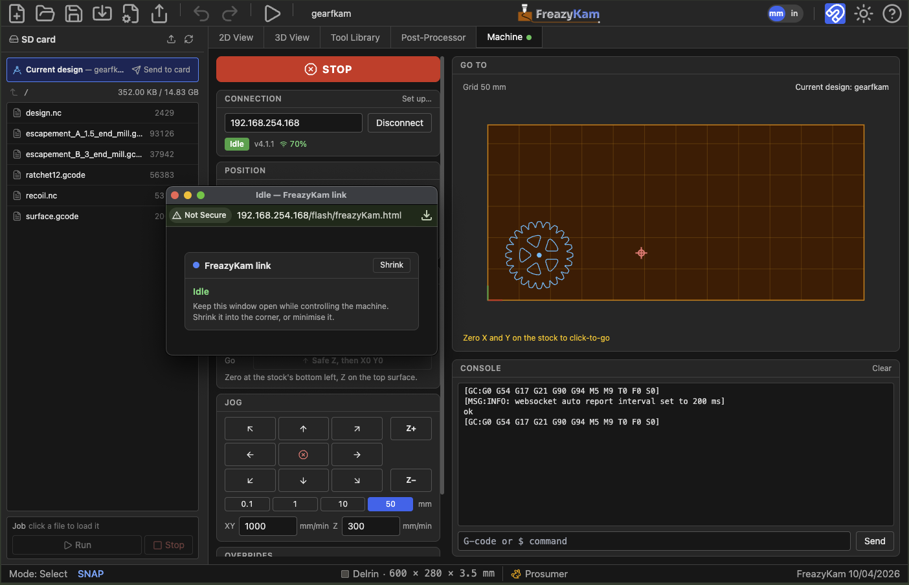

# 12. Running the machine

The **Machine** tab drives a FluidNC controller directly from FreazyKam, over your WiFi:
see where the machine is, home it, zero it, jog it, send the job to its SD card, run it,
and stop it. Nothing to install on your computer — it all happens in the browser.


| Where | What |
|---|---|
| **Sidebar** | The controller's SD card, the **Current design** entry, and the job box (Run, Pause, Cancel, Stop) |
| **Left column** | **STOP**, connection, position, home & zero, jog, feed and speed overrides |
| **Go to** | A map of the stock — click it to send the tool there — with the **Z bar** beside it showing the tool's height against the stock |
| **Console** | Everything the controller says, and a box to type commands into |

While the Machine tab is open the sidebar shows the SD card instead of the drawing
tools; switch back to **2D View** to keep designing.

---

## One-time setup: the relay file

Before FreazyKam can talk to a controller, one small file — the **relay** — has to be
copied onto that controller. You do this once per controller.

**Why it's needed.** FreazyKam is a secure (`https://`) website and the controller is a
plain (`http://`) device on your network. Browsers do not let a secure page talk to a
plain one directly. The relay is a tiny page that lives *on* the controller: FreazyKam
opens it in a small window and passes messages through it, and since the relay talks to
its own controller, the browser allows it.

### 1. Download the relay

The file's name depends on your FluidNC version. The WebUI's **About** box shows it.

| FluidNC | Save the relay as | How to get it |
|---|---|---|
| **v4.0 and later** | **`freazyKam.html`** | On the **Machine** tab, while not connected, the Connection section shows **Download freazyKam.html**. Click it |
| **v3** | **`404.htm`** | Open **How to install** at the top right of the Connection section and use its **download it as 404.htm** link |

**How to install** also walks through these steps. Keep the name exactly as it downloads:
not `freazykam.html`, `404.html` or `relay.html`.

**Why the two names.** FluidNC v4 shows any file on its flash as a page at
`http://<your controller>/flash/<name>`, so the relay can have its own name. FluidNC v3
hands any file you ask for by name to the browser as a download instead. The one
exception is its "page not found" page, `404.htm`, so on v3 the relay goes in under
that name. FreazyKam opens the same address either way,
`http://<your controller>/flash/freazyKam.html`. On v3 that address isn't a real file,
so FluidNC answers with its not-found page, which is the relay.

### 2. Copy it onto the controller's flash

1. Open the controller's own web page — the FluidNC WebUI — in your browser, at
   `http://fluidnc.local` or its IP address.
2. Open the **Files** panel and switch its drop-down from **SD** to **Flash**. It must go
   on the flash, *not* the SD card.
3. **Upload** the relay (`freazyKam.html`, or `404.htm` on v3) into the top folder,
   next to `index.html.gz` and your `config.yaml`.

Do not rename, replace or delete `index.html.gz` — that is the WebUI itself, and the
relay leaves it alone.

### 3. Check it

Open `http://fluidnc.local/flash/freazyKam.html` (or
`http://<IP address>/flash/freazyKam.html`). A small page titled **FreazyKam link** means
the relay is in place. Close that tab.

| You see | Means |
|---|---|
| **FreazyKam link** | Done |
| The browser **downloads a file** | v3 with the relay under the wrong name: it must be `404.htm` |
| A **blank** page or a **not found** page | The relay isn't on the flash under the name your version needs. Check you uploaded to **Flash**, not SD, and the name in [step 1](#1-download-the-relay) |

**Updating from an older FreazyKam?** Earlier versions always installed the relay as
`404.htm`, and that copy keeps working. On v3 nothing changes. On v4, if
`/flash/freazyKam.html` isn't there, Connect tries `http://<your controller>/freazykam`
next. That makes every Connect about 2 seconds slower. Upload `freazyKam.html`
and delete the old `404.htm` to skip the extra step.

### Good to know

- **On v3, the controller must be on your WiFi network** (FluidNC's *station* mode). If it
  is running its own WiFi network (*access point* mode), v3 answers every unknown address
  with a sign-in page, and the relay can't load.
- **Connect before you start a job.** While the machine is moving, FluidNC won't serve
  pages from its flash, so the relay can't open mid-cut. A job that is already running
  keeps running if FreazyKam disconnects.
- On v3, a **mistyped address** on the controller now shows the relay page instead of
  "not found". That's harmless — the relay only takes instructions from FreazyKam.
- If connecting starts failing after a FreazyKam update, the relay may have changed:
  download it again and replace the copy on the flash.

---

## Connecting

1. Type the controller's address into the Connection section — `fluidnc.local`, or its
   IP address if `.local` names don't work on your network. Just the address: leave off
   `/flash/freazyKam.html` — FreazyKam adds that itself, and tries the older `/freazykam`
   if that fails. (That longer address is only for checking
   the relay by hand, in [step 3](#3-check-it) above.)
2. Press **Connect**. A small **FreazyKam link** window opens: that is the relay. If the
   browser blocks it, allow pop-ups for FreazyKam and press Connect again.
3. Leave that window open — it can sit behind FreazyKam. Closing it disconnects.



The relay window's title shows the machine state (*Idle*, *Run*…), so you can read it
even when the window is shrunk into a corner.

Once connected, the Connection section shows:

- **The machine state** — *Idle*, *Run*, *Jog*, *Hold*, *Home*, *Alarm*. An **Unlock**
  button appears beside it in Alarm.
- **The firmware** the controller reports.
- **The WiFi signal** at the controller, as FluidNC reports it. Hover for the network,
  channel and signal in dBm.

| Signal | Colour | Meaning |
|---|---|---|
| 60% and up | Green | A reliable link |
| 45–59% | Amber | Usable, but the connection may drop |
| Below 45% | Red | Expect trouble |

The **Machine** tab shows a green dot while connected, so you can see the link is up from
any other tab.

**If the link drops,** FreazyKam reconnects by itself — up to four tries, two seconds
apart — and the console says how long the connection had been up. The loaded job and
your settings survive a reconnect, and so do your zeros as long as the machine reports
itself exactly where it was when the link dropped; if it moved (other than a job carrying
on) or restarted, the ✓ marks clear and the console says so. See
[When the link misbehaves](#when-the-link-misbehaves) if it happens often.

---

## STOP

The red **STOP** button at the top of the left column is always there while connected,
and stops whatever is moving:

| Moving | STOP | Result |
|---|---|---|
| A jog, a go-to click, *Safe Z, then X0 Y0* | Feed hold | Slows to a stop and cancels the move. No alarm, position kept |
| A job, or G-code typed in the console | Feed hold | Slows to a stop and pauses. Then **Resume**, or **Cancel** |
| A homing cycle | Soft reset | Homing ignores a hold, so it is reset. The machine alarms |

A feed hold stops quickly but under control: at a typical 1200 mm/min cutting feed the
tool travels about 1 mm while slowing, more from a fast rapid.

**STOP needs the WiFi link.** It is not a substitute for a way to kill the power to the
machine and the router — keep one within reach. FreazyKam has no control over the router's
own switch, so none of the software stops turn the router off.

---

## Position, home and zero

**Position** shows the **Work** position — measured from the zero you set on the stock —
large, and the **Machine** position beside it. Units follow the toolbar's mm/in toggle.

### Home & Zero

| Row | Buttons | Does |
|---|---|---|
| **Home** | All · X · Y · Z | Runs FluidNC's homing cycle against your limit switches (`$H`, `$HX`…) |
| **Zero** | All · X · Y · Z | Makes the current position work zero on that axis |
| **Motors** | Enable · Disable | Powers the stepper motors on, or releases them so the axes move by hand |
| **Go** | Safe Z, then X0 Y0 | Raises Z to the safe height, then moves to the work zero |

- **No limit switches?** Untick **Limit switches** in the section header and the Home row
  disappears. Jog to the stock and zero there instead.
- A **✓** beside an axis means it has been zeroed **on the stock**, with its Zero button,
  on this connection. **Homing alone doesn't tick anything:** it fixes where the machine
  is, not where the stock is. So home first, then jog to the stock and zero.
- **Disconnect**, motor **Disable** and any **Alarm** clear the ✓ marks: the machine may
  have been moved by hand, switched off or lost steps. To get a zero back, home that axis
  again. If you zeroed it after homing earlier in the session, and nothing has changed
  the offset since, the ✓ comes back (the console says so). Otherwise zero it again.
  This assumes the same bit is in the spindle; after a bit change, always re-zero Z.
- **No limit switches** (box unticked)? A machine that can't home would lose every zero
  to a disconnect, so instead: when you reconnect, if the controller reports *exactly*
  the position and offsets it had when the connection ended, the ✓ marks come back and
  the console says so. A restarted controller wakes at machine 0, 0, 0, which is how a
  restart is caught — so a disconnect with the machine at exactly 0, 0, 0 isn't
  restored. A reload of FreazyKam forgets them.
- The line under the buttons says **where to zero**: the stock's origin corner from
  Setup, and whether Z0 is the top surface or the bottom of the stock. Zero where it says
  — that is where the toolpaths are measured from.
- **Disable** releases the motors (and clears the ✓ marks), but any jog, go-to or job
  turns them straight back on — it is not a lock.
- **Safe Z, then X0 Y0** needs all three axes zeroed, since the safe height is measured
  from Z zero.

---

## Jogging

The **XY pad** reads as you face the machine: up moves **away** from you (+Y), right
moves +X. **Z+** and **Z−** are beside it. The centre **⊗** cancels a jog in progress.

- **Step** — the **XY** row under the pad (0.1, 1, 10, 50 mm, or 0.001, 0.01, 0.1, 1
  inch), and the **Z step** between Z+ and Z−: **−** and **+** either side of it choose
  0.1, 0.5, 1 or 5 mm (0.005, 0.02, 0.05, 0.2 inch). Each is kept
  between sessions, so a big XY step for crossing the stock never becomes a big plunge
  on Z−.
- **Orange outlines** — once Z is zeroed, the XY arrows turn orange while the tool is below
  the stock surface (an XY jog there cuts), and **Z−** turns orange whenever its next step
  would end below the surface. Nothing is blocked; it's a reminder.
- **Feeds** — separate jog feeds for XY and Z, kept between sessions.

Jogs work before anything is zeroed — that's how you get the tool to the stock to zero it.

---

## The go-to map

The **Go to** map shows the stock as set up in Setup, in its material's colour, the tool's
position (a blue crosshair, once X and Y are zeroed), work zero (red and green axis lines),
and one of two things on the stock, depending on what is picked in the sidebar:

- **Current design** — the toolpaths of the design open in FreazyKam.
- **A file from the SD card** — that file's toolpath, with its name and extent in the
  corner, and a **Runs off the stock** warning if it goes past the stock's edges.

Only cutting moves are drawn — rapids are left out — so the design and a file posted from
it look the same.

**Click anywhere on the map to send the tool there.** This needs X and Y zeroed and the
machine Idle; until then the map says what it's waiting for. If Z has been zeroed and the
tool is below the safe height, Z rises first, so the bit isn't dragged across the stock. A
blue circle marks where you clicked, with a dashed line from the tool, until the move
finishes. **STOP** or the jog pad's **⊗** cancels it.

### The Z bar

The bar to the left of the map is the same stock seen **from the side**, lined up with
the map: its bottom is level with the stock's bottom edge, and its top stands for twice
the safe height. On it:

- **the stock**, in its material colour, from its bottom to its top surface;
- **Safe** (dashed green) — the safe height: the job's own, from its rapids, when a file
  from the card is picked, otherwise the one in Setup;
- **Max** (dashed blue) — the deepest the toolpaths cut;
- **the tool**, blue, its tip at the current Z, with the Z value beside it.

The tool appears once Z is zeroed — before that there is no telling where it is against
the stock. Raised higher than the top of the bar (after homing, say), it stops at the top
with an arrow, and the number still gives the real height.

---

## The SD card

The sidebar lists the files on the controller's SD card. Click a folder to open it, and
**↰** to go up.

| | |
|---|---|
| **Current design** | Shows the design open in FreazyKam on the map |
| **Send to card** | Writes the design's G-code to the card as `<project name>.nc` and loads it, ready to run. Replaces a file of the same name |
| **Upload** (header) | Copies a G-code file from your computer to the folder shown |
| **Refresh** (header) | Re-reads the card |
| **Click a file** | Loads it: reads it off the card and shows its toolpath on the map |
| **Bin** (on hover) | Deletes a file — click once to arm, again to confirm |

- **Loading only reads the file.** Nothing happens on the machine until you press **Run**.
- Uploading and deleting are switched off while a job is running, so the card isn't
  busy with two things at once.
- If a file has a **line longer than 80 characters**, loading it shows a warning. Recent
  FluidNC stops a job at a line over 127 characters with *"Line too long"*. Files
  FreazyKam writes never have such lines; files from elsewhere might.

---

## Running a job

The job box at the bottom of the sidebar names the loaded file.

**Run** starts it from the SD card. It is enabled only when:

- **X, Y and Z are all zeroed** — the job's coordinates mean nothing until they are.
- **The job is what the map is showing** — not the Current design — so what you see is
  what you cut.
- **The card is not busy** loading or uploading — otherwise Run could start the file
  you were moving away from.

While it runs, a **progress bar** shows how far through the file the controller has
read. (It reads a few moves ahead of the cut, so the bar leads the tool slightly.)

| Button | Does |
|---|---|
| **Pause** | Feed hold — slows to a stop and holds. The spindle keeps turning |
| **Resume** | Carries on from where it paused |
| **Cancel job** | Appears once a pause has fully stopped. Ends the job **without an alarm** — position and zero kept — and raises Z to the safe height |
| **Stop** (■) | Stops at once with a soft reset. The machine alarms, because it was moving |

**To end a job early, Pause then Cancel.** *Stopping…* shows while the machine slows
down; Cancel unlocks when it has come to rest. Stopping a moving machine with a reset can
lose position — the gantry's momentum makes the motors skip — which is why FluidNC alarms
and you would need to re-zero.

After a **Stop** or any alarm, press **Unlock** beside the state, then check the machine
before carrying on.

---

## Overrides

Change the feed and speed of a running job without stopping it.

| | |
|---|---|
| **Feed** | ‹ and › step 5 % at a time (to the next multiple of 5), and ↺ goes back to 100 %. Under the label: the actual feed, and while overridden what the program asked for first — *1200 → 960 mm/min* |
| **Rapid** | 25, 50 or 100 % |
| **Spindle** | As Feed, for a VFD spindle the controller drives |
| **Router** | A router set by its own dial (DeWalt, Makita, or a manual spindle — the spindle type in Setup) ignores the controller's speed, so instead of an override this shows **what to set the dial to** for the speed the program asks for: *Dial 2.5 (19,800 rpm)* |

The percentages shown are what the controller reports, so its limits (10–200 %) read
true. Anything other than 100 % shows in blue.

---

## The console

Everything the controller says, plus the commands FreazyKam sends (lines starting `>` —
you could type any of those into the box yourself). Lines starting **◆**, in italics, are
**button actions** — STOP, jog cancel, reset, overrides — which go to the controller as
single control bytes rather than text; the byte is shown at the end, but there's nothing
there to type.
Type G-code or a `$` command into the box at the bottom and press Enter. **Clear** empties
it.

Useful commands:

| Command | Does |
|---|---|
| `$X` | Clears an alarm (same as **Unlock**) |
| `$C` | Check mode: runs a job without moving, to prove the file works. `$C` again to leave |
| `[ESP420]` | The controller's status, including its WiFi signal |
| `[ESP410]` | The WiFi networks the controller can hear |

---

## When the link misbehaves

| Symptom | Likely cause | What to do |
|---|---|---|
| *No answer from the relay* on Connect | The controller is off, at a different address, or the relay isn't installed | Check the address; open `http://<controller>/flash/freazyKam.html` — see [Check it](#3-check-it) |
| The relay window downloads a file | v3, with the relay saved under the wrong name | Re-upload it as `404.htm` |
| Connect takes a couple of seconds longer than it used to | v4 holding only an older `404.htm` relay | Upload `freazyKam.html` (see [step 1](#1-download-the-relay)) |
| Connect works, then drops every few minutes | A weak or crowded WiFi link | Check the signal in the Connection section |
| Signal amber or red | The controller is too far from the router, or its antenna is boxed in | Move the antenna clear of metal; use a nearby WiFi extender |
| Connected to the wrong network | It joined the router instead of a closer extender | Give the extender its own network name, then point the controller at it (below) |
| *Line too long* stops a job | A line over 127 characters | Regenerate the file from FreazyKam, or shorten the line |

**Choosing which network the controller joins.** If your extender broadcasts the same
name as your router, the controller may join the farther one. Give the extender's
2.4 GHz network its own name (the controller only uses 2.4 GHz), then in the console:

```
$Sta/SSID=Your_Extender_Name
$Bye
```

`$Bye` restarts the controller onto the new network. Add `$Sta/Password=…` before it if
the extender's password is different. If the name or password is wrong, the controller
starts its own WiFi network (usually called *FluidNC*) instead — join that from your phone
and fix the settings in its WebUI.

**On a busy 2.4 GHz channel,** changing your router's 2.4 GHz channel to 1 or 11 can make
a large difference — the extender follows the router's channel by itself. Pick a fixed
channel rather than Auto, so the router doesn't switch mid-job.

---

## Next

- **[11. When something goes wrong](11-troubleshooting.md)** — problems with the design
  and its toolpaths
- **[Back to the guide](README.md)**
