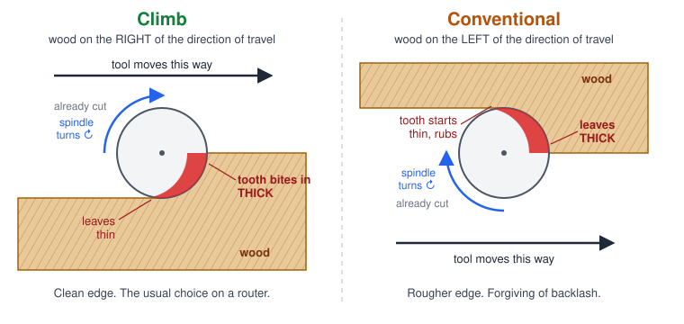

# Climb vs conventional milling

The spindle always turns the same way: clockwise, seen from above. What changes is **which
side of the bit the wood is on** as it moves. That decides how each tooth takes its chip.

*Top view. The red crescent is one tooth's chip.*

| | Climb | Conventional |
|---|---|---|
| Wood is on the | **Right** of the direction of travel | **Left** of the direction of travel |
| Chip | Starts thick, ends thin | Starts thin, ends thick |
| Edge finish | Cleaner | Rougher (the tooth rubs before it bites) |
| Pushes the bit | Away from the work | Into the work |
| Needs | A machine without much backlash | Tolerates backlash |

## Which to use

**Climb** is the normal choice on a router in wood. It gives a cleaner edge.

Use **conventional** if:
- Your machine has backlash it can't take up (the bit gets pulled into the cut).
- The material tears out where the cut starts.

## You don't have to work out the direction

Pick **climb** or **conventional** in the operation's **Direction** field. The app then
runs the tool the right way round for you: round a part's outline, inside a hole, or
across a pocket.
