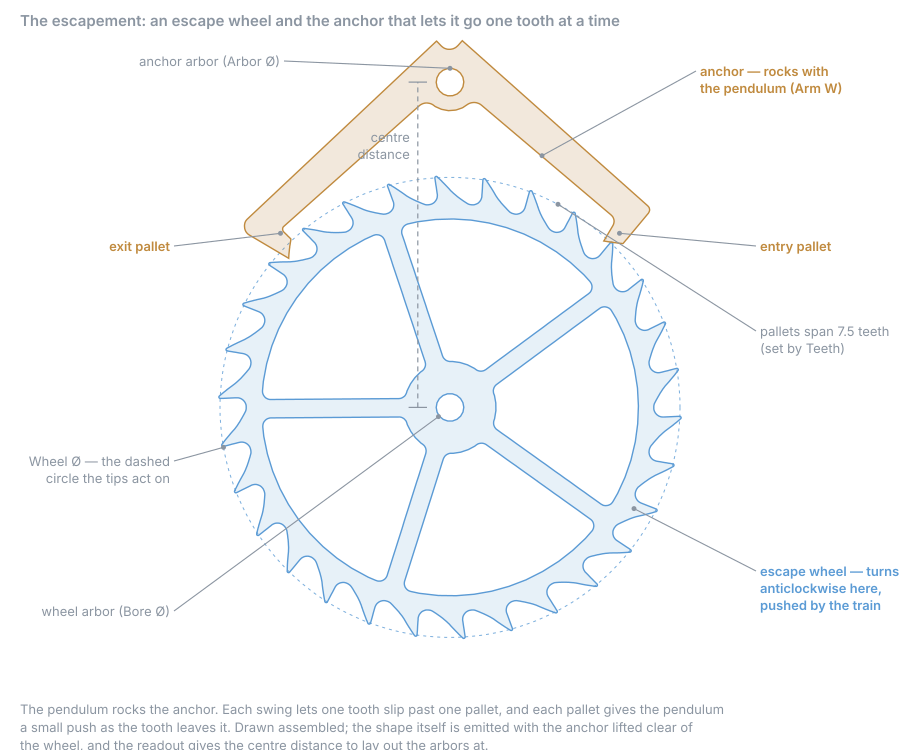
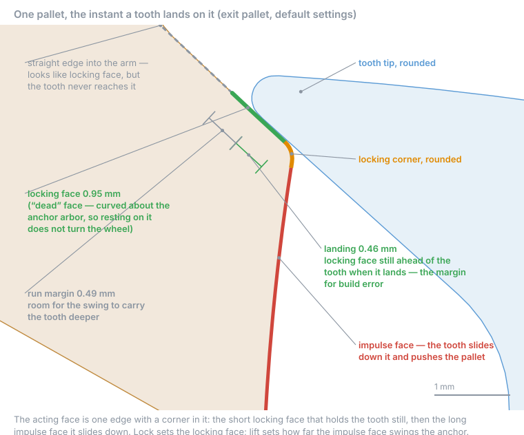
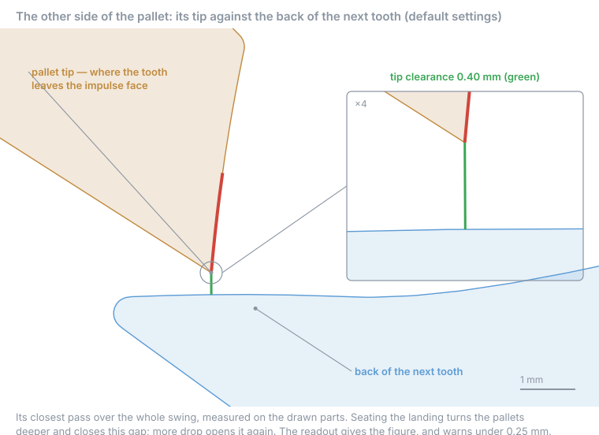

# How an escapement works

The escapement lets a clock's wheels turn one small step at a time, in time with the
pendulum. The weight pushes the **escape wheel** round. The **anchor**, rocked by the
pendulum, stops and releases it.

## One beat, four steps

1. **Lock.** A tooth rests on the pallet's **locking face**. The face is curved around the
   anchor's pivot, so the pallet slides under the tooth without moving the wheel. That's
   what makes a deadbeat "dead".
2. **Unlock.** The pendulum swings back until the tooth reaches the corner.
3. **Impulse.** The tooth slides down the sloped **impulse face**, pushing the pallet. This
   push keeps the pendulum going.
4. **Drop.** The tooth leaves the pallet. The wheel spins freely for a moment until a tooth
   lands on the other pallet. Then it repeats in reverse.

One beat = half a tooth. Two beats = one tooth.

A **recoil** escapement has no locking face. The tooth lands on a slope, and the pendulum's
extra swing pushes the wheel back slightly. That's the shudder you see on an old clock's
second hand.

## Why the wheel and anchor come together

The pallet shapes are traced from **this** wheel's tooth tips. An anchor from one design
won't work with a wheel from another.

## The landing: your safety margin

**Landing** is how much locking face is ahead of the tooth when it lands. Every build error
eats into it: arbors too far apart, short tips, loose pivots, wear. When it runs out, the
tooth lands on the impulse face, which can't hold it, and the wheel runs away.

The target is **0.5 mm**. More **Lock** lengthens the face to reach it.

Why not more? Seating a deeper landing turns the pallets further into the wheel. That
reduces tip clearance and adds friction.

**Don't judge it by eye.** The pallet's edge runs straight on into the arm and looks like
more locking face than there is. Trust the readout, not the animation.

## Tip clearance

The pallet's tip passes close to the **back of the next tooth**. The readout warns under
0.25 mm.

## The trade-off

| More of | Gains | Costs |
|---|---|---|
| Lock | Landing margin | Energy, tip clearance |
| Drop | Tip clearance | Energy (drop is wasted each beat) |
| Draw | Holds the lock | Nothing. Keep 1–2° |

The defaults (lock 1.5°, drop 2°) came from testing about 3,600 combinations.

**Reference:** [Escapement settings and readout](../reference/escapement.md)
