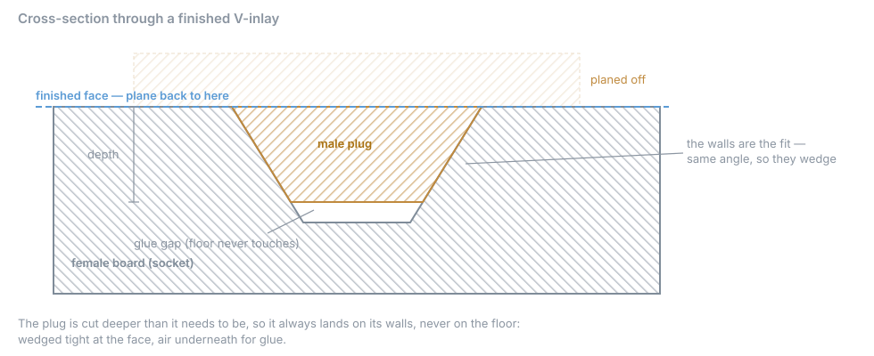

# Why inlays fit

## The problem with straight walls

A straight plug in a straight hole must be the **exact** size. A bit too big won't go in. A
bit too small leaves a gap.

## V-walls solve it

Cut both halves with the **same V-bit**. The plug is a wedge, the socket a matching wedge.
Push the plug in and it slides down until the walls meet. Wherever it stops, it's tight.

From that picture:

1. **The walls are the joint.** Same bit angle on both halves.
2. **The bottom must not touch.** That's the **Glue gap**. Glue needs somewhere to go.
3. **You make the face by sanding.** Glue it, let it cure, then plane down to the socket
   board's surface. The seam closes as you get there.

## Why Mirror

The plug board is flipped over to go in. Text or any one-sided design would read backwards.
**Mirror** cuts the plug reversed so it reads right after flipping.

## Why not a taper

A taper's tip is rounded. On the plug, that rounding ends up at the top edge, where you
look. On the socket, it's at the bottom. They don't match, so a hairline gap shows: about
0.2 mm for a 0.25 mm tip. The angle doesn't matter. The plug still seats, but you'll see
the line.

A V-bit has a true point, so plug and socket match exactly.

## Why Invert

A design inside a background can be read two ways: the design is the plug, or the
background is. **Invert** chooses. The form says which in words, so you can check.

**How-to:** [Make an inlay](../how-to/make-an-inlay.md)
