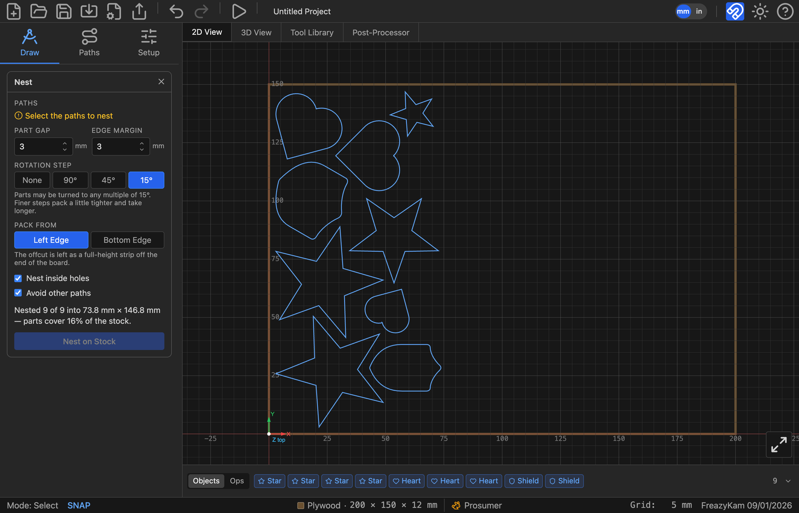

# Nesting for a usable offcut

Nesting fits parts onto a sheet. The goal isn't just to fit them, but to leave the
leftover as **one useful piece**, not scraps.



## Pack From shapes the offcut

```
  Left Edge                    Bottom Edge
  ┌───────────┬──────┐         ┌──────────────────┐
  │ parts     │      │         │     offcut       │
  │ packed    │offcut│         ├──────────────────┤
  │ here      │      │         │ parts packed here│
  └───────────┴──────┘         └──────────────────┘
  long strip left over         wide band left over
```

Same waste, different shape. A strip is good for rails; a band suits panels.

## Rotation Step is a step, not a limit

**45°** means "any multiple of 45°", so 0°, 45°, 90°, 135°, 180°… It does not mean "up to 45°".

Finer steps pack tighter but take longer. On plywood or MDF use 15°. Where grain shows, use
**None**.

## Nest inside holes

Fits small parts inside big ones. Saves material, but the offcut ends up in pieces.
Worth it on expensive stock.

## Reading the report

*Nested 9 of 9 into 73.8 × 146.8 mm — parts cover 16 % of the stock.*

- **9 of 9:** all fitted.
- **Size:** the area actually used.
- **%:** how much of the stock the parts cover. Awkward shapes cover less, even when packed
  tightly.

**How-to:** [Nest parts](../how-to/nest-parts.md)
