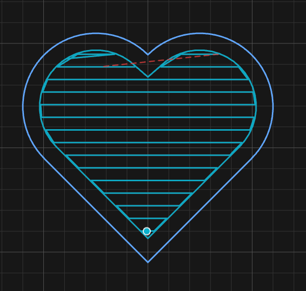
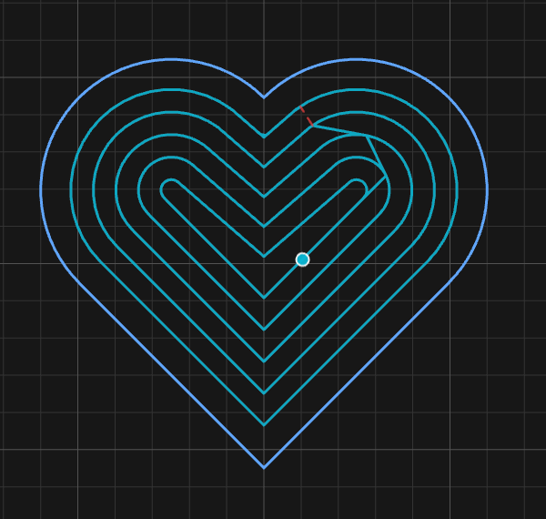
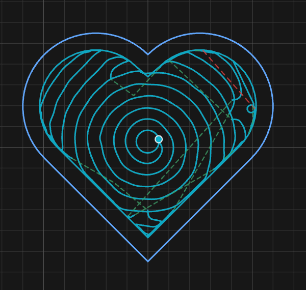

# The five pocket strategies

A strategy is the pattern the bit follows to clear an area. Here's the same heart cleared
five ways:

| Auto | Raster | Contour | Morph | Adaptive |
|:---:|:---:|:---:|:---:|:---:|
|  |  |  |  |  |

| Strategy | How | Best for |
|---|---|---|
| **Auto** | Mixes the others per area | **Almost everything. Start here** |
| **Raster** | Straight back-and-forth lines | Simple open pockets |
| **Contour** | Rings following the edge inward | Tracing walls and islands |
| **Morph** | One unbroken spiral | Smooth shapes, fewest lifts |
| **Adaptive** | Keeps the bit's bite constant | Hard material, deep pockets |

## Contour vs Morph

They look alike. **Contour** is separate rings with a lift between each. **Morph** is one
continuous spiral with no lifts. That's why Morph can't do every shape.

## When a strategy declines

Some shapes don't suit Morph (or others). Instead of making a bad path, the app uses Auto
and tells you. **Alt**-click Generate to force it anyway.

## Clean-up is automatic

Every strategy leaves a little behind in tight corners. A **rest-clearing pass** always
runs to take that off lightly before the final wall pass.

## Stepover

How far apart the passes are, as a % of the bit's width. Smaller = cleaner floor, longer
job. On Adaptive it's called **Engagement**.

**How-to:** [Clear a pocket](../how-to/clear-a-pocket.md)
