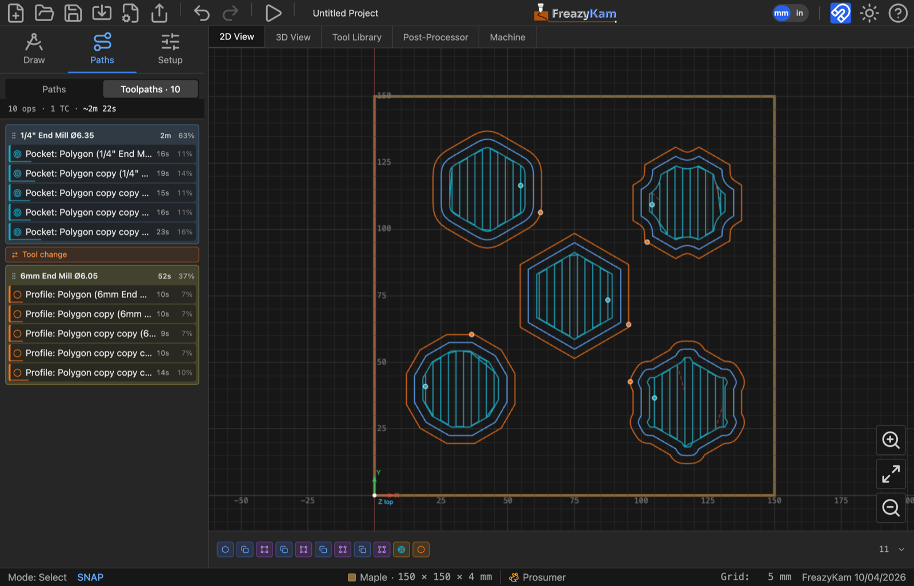

# Change the cut order

1. Click the **Paths** tab in the sidebar.
2. Click **Toolpaths**.
3. Drag a row up or down. Drag a tool's header to move all its rows.

The list top-to-bottom is the order the machine cuts.

## Fewer tool changes

If a **Group by tool** button appears, click it to put each tool's cuts together.
Check the order after: you still want **inside features first, outlines last**.

## Leave a cut out

Hover the row and click the **eye**. Hidden cuts are left out of the G-code.

**Related:** [Operations and the program](../explanation/operations.md)
