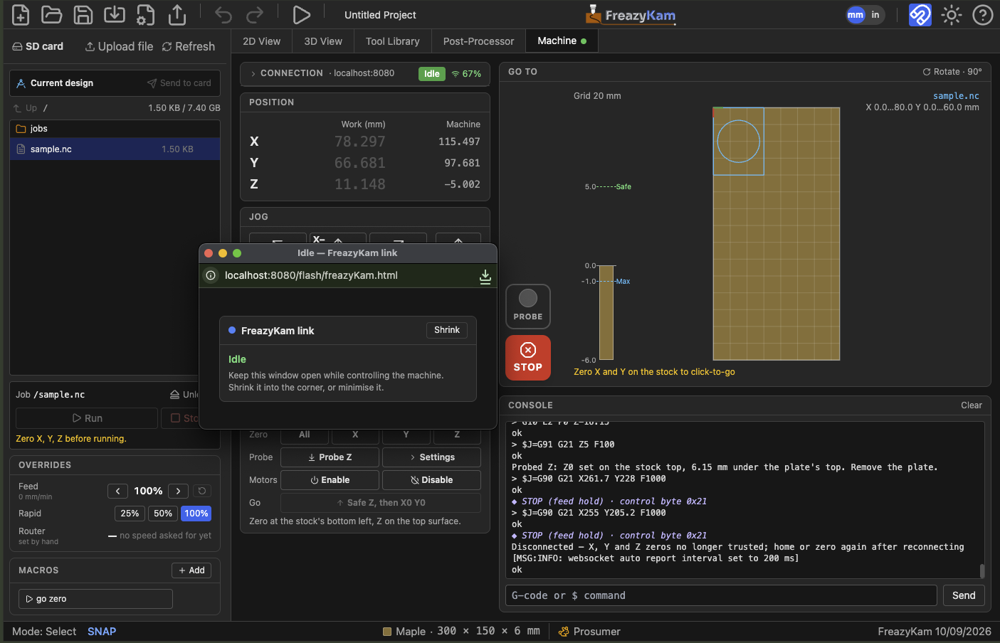

# Connect to your machine

**First time?** [Install the relay file](install-the-relay.md).

1. Click the **Machine** tab.
2. Type the address: `fluidnc.local` or the IP address. Just the address.
3. Click **Connect**.
4. A **FreazyKam link** window opens. Leave it open. It can sit behind.

Pop-up blocked? Allow pop-ups for FreazyKam and click Connect again.

## Connected

- The **Machine** tab shows a green dot.
- The state shows **Idle**. In **Alarm**, click **Unlock**.
- The WiFi signal should be **green** (60 % or more).

## Good to know

- Connect **before** starting a job. The relay can't open while the machine moves.
- If the link drops, the app retries four times by itself.
- Closing the link window disconnects.

**Problems?** [Fix a weak WiFi link](fix-wifi.md)
