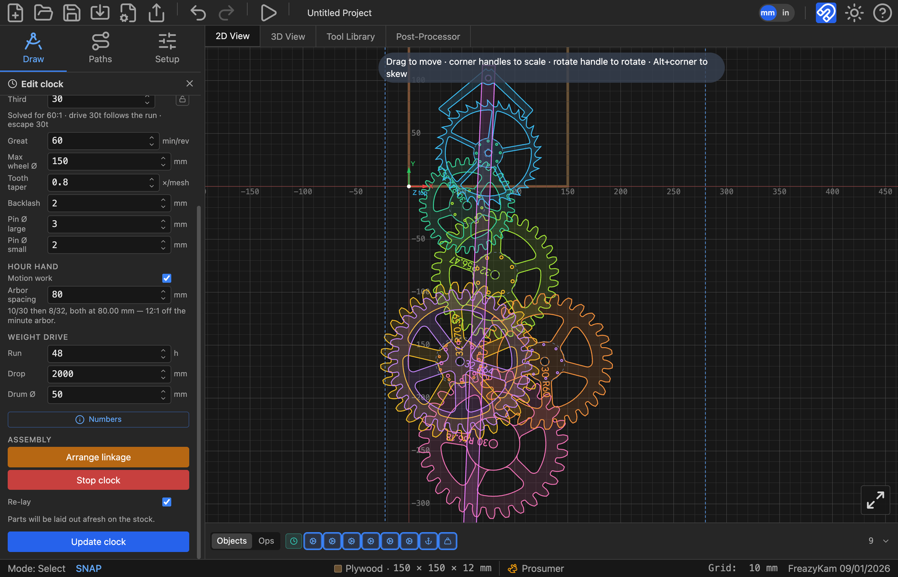

# Design a clock

The clock designer works out a whole set of wheels from the beat you want.

1. Open the shape picker and click **Clock**.
2. Under **Pendulum**, set **Beat** (seconds) and **Esc teeth**.
3. Under **Going train**, set **Max wheel Ø** to fit your stock.
4. Under **Hour hand**, tick **Motion work** if you want an hour hand.
5. Under **Weight drive**, set **Run** (hours), **Drop** and **Drum Ø**.
6. Place it.

Each wheel, the anchor and the pendulum appear as separate shapes you can edit.

## Red text in the panel?

The beat can't be made exactly with whole tooth counts. Change the beat or the wheel
settings until it goes away.

## Check it

Under **Assembly**, click **Animate whole clock**. If it doesn't turn on screen, it won't
turn in wood.

## Escapement warnings

Open the escapement's readout. Follow the colour of the worst line. See
[Escapement settings](../reference/escapement.md#readout-lines).

**Related:** [How an escapement works](../explanation/escapement.md) ·
[Gears and clock trains](../explanation/gears-and-clocks.md)
