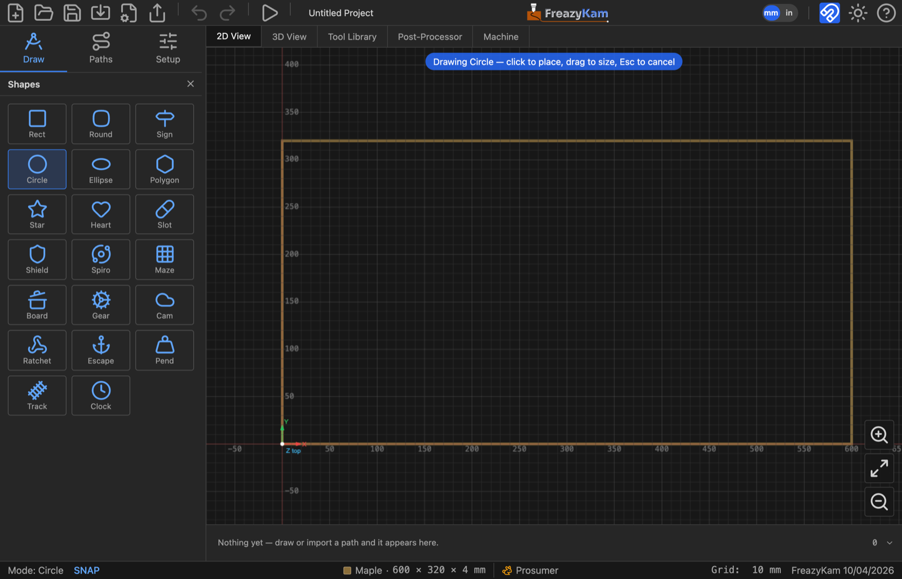

# Draw a shape

1. Click the **Draw** tab.
2. Click the **arrow under the shape button** to open the picker.
3. Click a shape.
4. Type its size in the fields that appear.
5. **Click** the canvas to place it at that size, or **drag** to size it by eye.
6. Press **Esc** when done.

## Tips

- The shape button remembers the last shape. Next time, just click it.
- Tick **From centre** to drag outward from the middle.
- Click the same spot twice to get shapes with the same centre.
- Gear, Escapement, Pendulum and Track ignore dragging. Their size comes from their settings.

## Change it later

Click the shape. Its settings appear in the **Properties** panel. Edit them any time.

**Related:** [All shapes](../reference/shapes.md) · [Draw with the pen](draw-with-the-pen.md)
