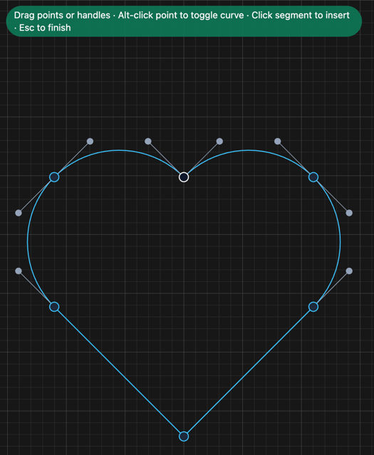

# Edit points on a path

1. **Double-click** the path.
2. Make your changes:

   | To | Do |
   |---|---|
   | Move a point | Drag it |
   | Reshape a curve | Drag a grey handle |
   | Add a point | Click on the line |
   | Delete a point | Hover it (turns red), press **Delete** |
   | Corner ↔ curve | **Alt**-click the point |
   | Undo one edit | **Ctrl+Z** |

3. Press **Esc** or click away to finish.

The **white** point is where the path starts.

**Related:** [Draw with the pen](draw-with-the-pen.md)
