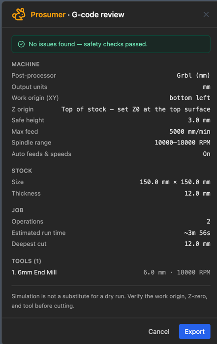

# Export G-code

1. Check your [post-processor](set-up-your-post-processor.md) is right (first time only).
2. Click **Export G-code** in the toolbar.
3. Read the review:
   - **Origin lines** match how you'll zero the machine?
   - **Deepest cut** is less than your stock (unless cutting through)?
   - **Run time** is what you expect?
   - **Tools** are the ones you have?
4. Read any warnings.
5. Using more than one tool? Tick **Split into one file per tool**.
6. Click **Export** (or **Export anyway** if there are warnings).

The file goes to your downloads folder.

## FluidNC user?

Skip the file. [Send it straight to the machine](run-a-job.md).

**Related:** [Messages and warnings](../reference/messages.md)
