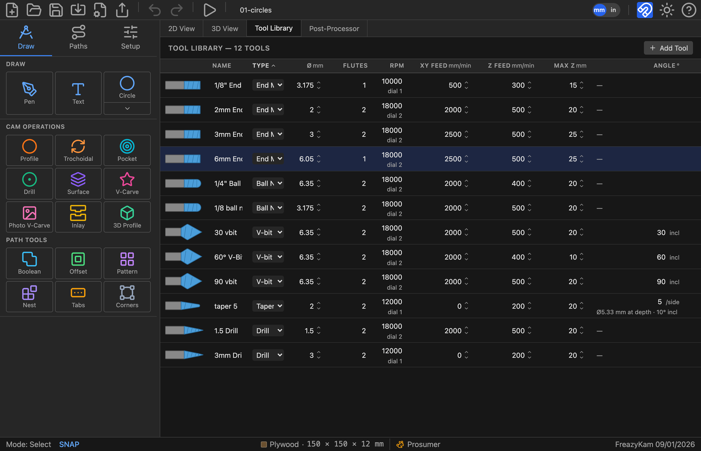
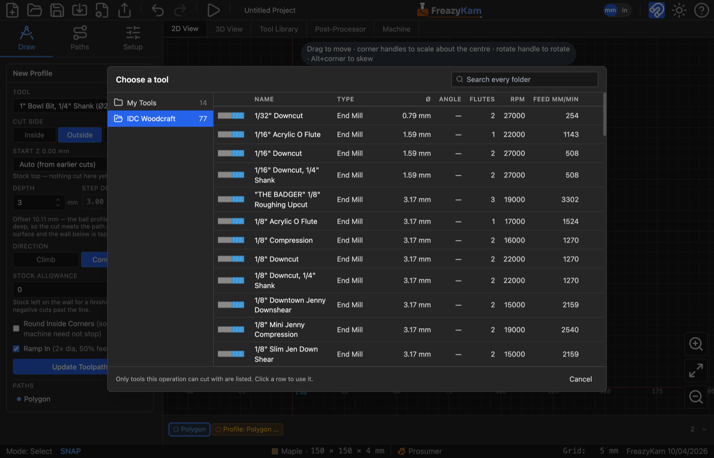

# Import a maker's tool catalogue

Most bit makers publish a **Fusion 360 tool library** (`.json`). FreazyKam can read it.

1. Download the Fusion 360 library from the maker's website.
2. Click the **Tool Library** tab.
3. Click **Import** and pick the file.
4. Choose the folder name (the maker's name is suggested).
5. Check the list, then confirm.

The tools go into their own folder. Your own tools are never changed.

## Use a catalogue bit

- **In an operation:** open the **Tool** list and pick **Browse library…**. Click a bit to
  use it.
- **Keep it in My Tools:** hover the row and click the **copy** icon.

## Good to know

- Round-over bits are skipped. The dialog lists them.
- Importing the same file twice adds nothing.
- A `.fkset` file from another FreazyKam user imports the same way.

**Related:** [Add a tool](add-a-tool.md) · [File formats](../reference/file-formats.md)
