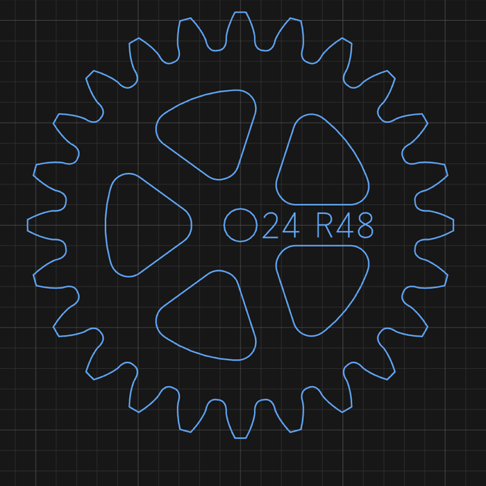

# Make a gear

1. Open the shape picker and click **Gear**.
2. Set:

   | Field | Enter |
   |---|---|
   | **Module** | Tooth size. Gears that mesh need the same module |
   | **Teeth** | Number of teeth |
   | **Profile** | **Involute** for general use, **Cycloidal (clock)** for clocks |
   | **Pressure** | Involute only. Pressure angle (both gears the same) |

3. Click the canvas to place it.
4. Set **Bore Ø**, **Hub Ø**, **Spokes**, **Spoke W** and **Rim** for the wheel body.

The size comes from Module × Teeth. You can't drag to resize it.

## Check two gears mesh

1. Place both gears.
2. Click **Animate in mesh** in the Properties panel to watch them turn.
3. Use the **centre distance** the panel reports to space them.

## Cut it

Profile **outside** around the gear. Use a bit small enough to reach between the teeth.

**Related:** [Gear settings](../reference/shapes.md#gear) ·
[Gears and clock trains](../explanation/gears-and-clocks.md)
