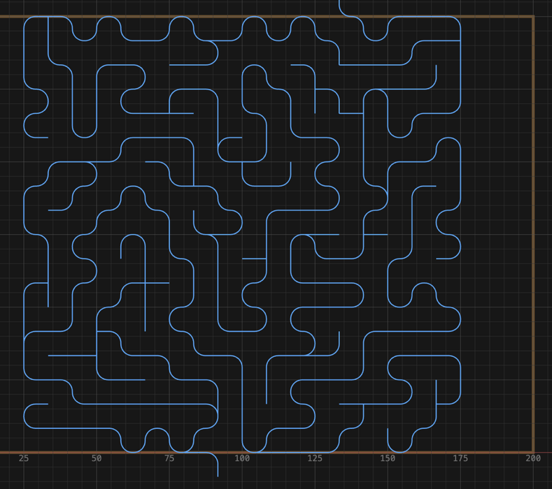

# Make a marble maze

1. Open the shape picker and click **Maze**.
2. Set **Width** and **Height**.
3. Set **Spacing** to your cutter's diameter plus the wall thickness you want.
   Example: 6 mm ball nose + 2 mm walls → `8`.
4. Optional: **Corner** rounds the corridor bends, **Loops** reopens that share of dead ends into loops, and the dice
   button beside **Seed** makes a new maze.
5. Place it. Leave a pitch of room above and below for the entrance and exit leads.
6. Select it and click **Profile**.
7. Set **Cut Side** to **centerline** and pick a **ball nose**.
8. Generate.

The panel shows the cell grid and the actual pitch (Spacing rounds up to fit whole cells),
with the rule **Wall = pitch − cutter Ø**.

The lines are where the cutter goes. The wood left between them is the wall. Making the
maze bigger adds more corridors. It doesn't make them wider.

