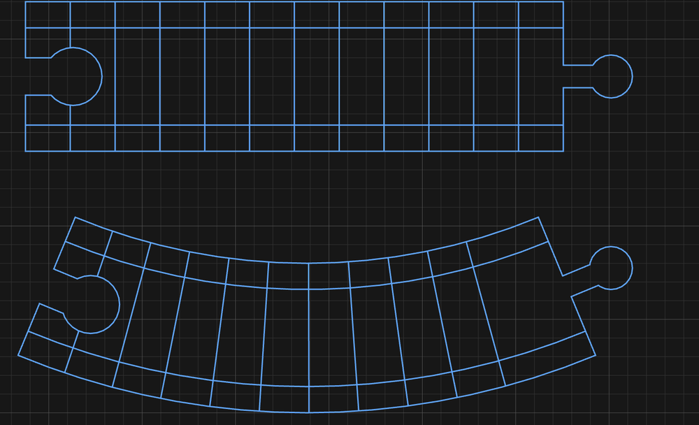

# Make train track

Makes BRIO-compatible wooden track from 12 mm stock.

1. Open the shape picker and click **Track**.
2. Set **Kind**: **Straight**, **Curve** or **Turnout**.
3. Set **End A** and **End B** (on a turnout: **Toe**, **Main**, **Branch**) to **Peg**,
   **Socket** or **Square**.
4. Set **Clearance**. Peg and socket both follow it.
5. Place it.
6. **Double-click** to split it, then cut:

   | Part | Operation | Tool |
   |---|---|---|
   | Rail grooves | Profile, **centerline** | 6 mm ball nose or core box |
   | Outline | Profile, outside | End mill |

Grooves are centrelines. Don't profile them as outlines.

