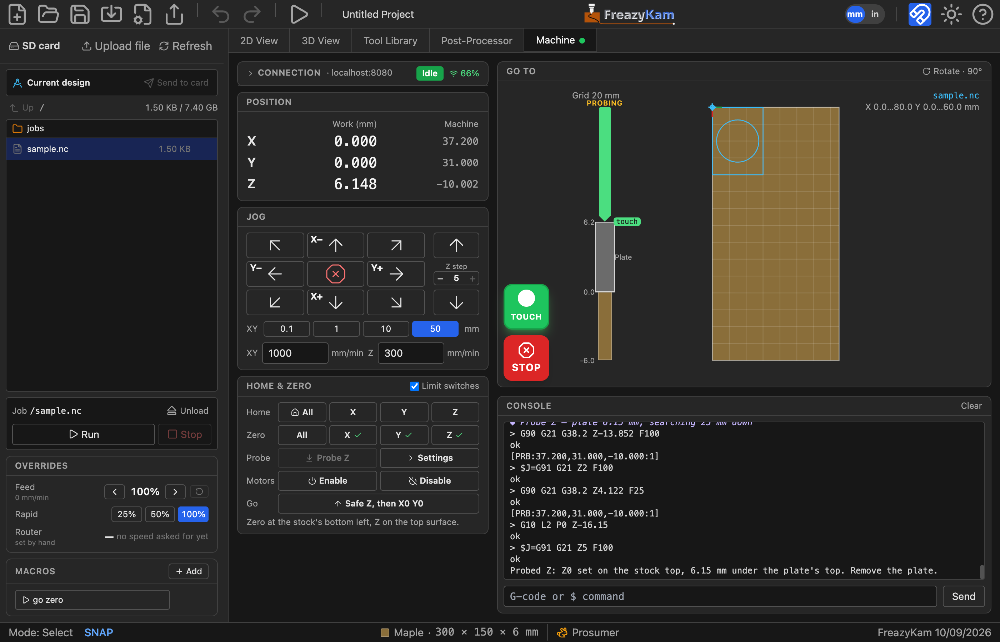

# Find Z with a touch plate

**You need:** a touch plate wired to the controller's probe input, and a clip on the bit.

## First time

1. Click **Settings** beside **Probe Z**.
2. Enter your plate's measured thickness as **Plate**.
3. Touch the plate to the bit. The **probe light** above STOP should turn green and read
   **TOUCH**.

## Each time

1. Jog the bit above the stock, within 25 mm.
2. Put the plate under the bit:
   - **Top of stock** origin: on the stock.
   - **Bottom of stock** origin: on the table.
3. Clip on.
4. Click **Probe Z**.
5. Remove the plate when the bit lifts.

Z now shows **✓**.

## Problems

| Problem | Fix |
|---|---|
| Won't start | The probe already reads touching. Check the clip is on the bit |
| Alarm: nothing touched | Click **Unlock**, move closer, try again |
| "No probe" message | Add `probe: pin:` to the controller's config |

**STOP** cancels probing and sets nothing.

**Related:** [Probe settings](../reference/machine-tab.md#probe-settings)
