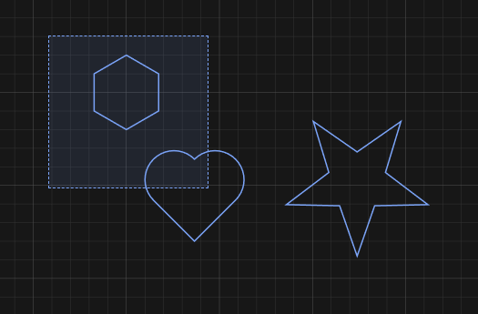
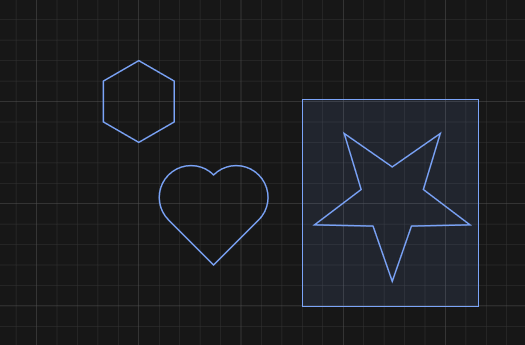
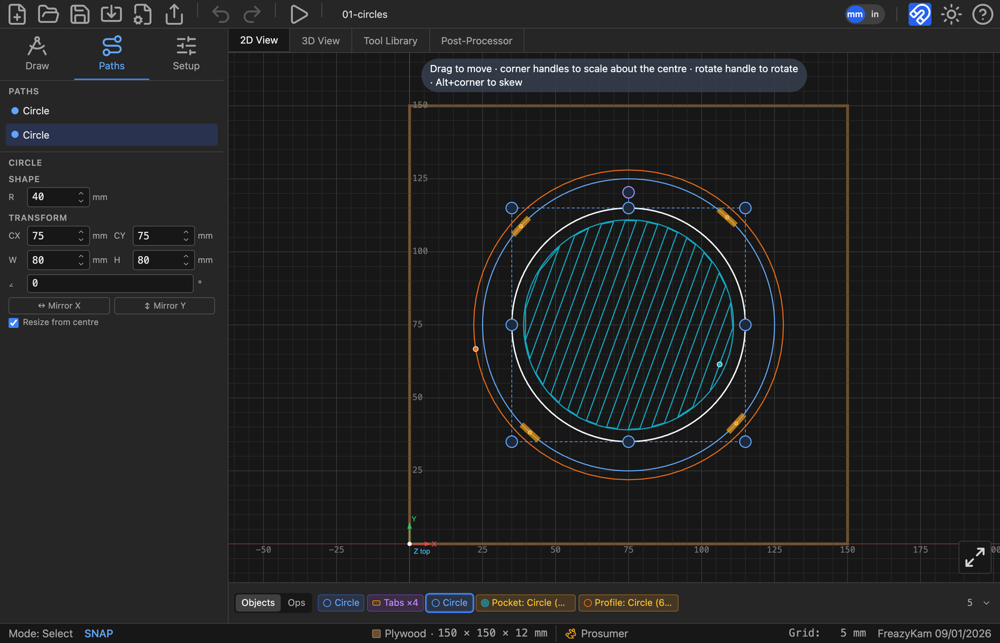

# Select exactly what you want

| To select | Do |
|---|---|
| One path | Click it |
| Several | **Shift**-click each |
| One path inside a group | **Alt**-click it |
| Everything a box touches | Drag **right →** (dashed box) |
| Only what's fully inside a box | Drag **← left** (solid box) |
| Nothing | Click empty canvas, or press **Esc** |

| Drag right: touches | Drag left: fully inside |
|---|---|
|  |  |

## Can't click it?

Use the **Paths** tab in the sidebar. It lists everything by name. Click a name to select it.

**Related:** [Keyboard and mouse](../reference/keyboard-and-mouse.md)
