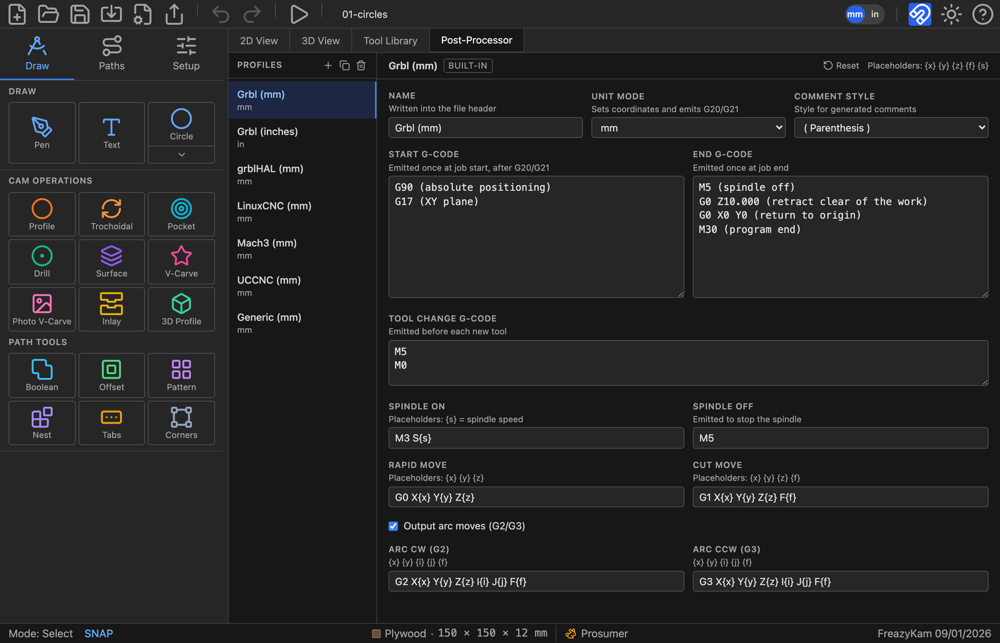

# Set up your post-processor

The post-processor writes G-code in your controller's dialect.

1. Click the **Post-Processor** tab above the canvas.
2. Click the profile that matches your controller:

   | Controller | Profile |
   |---|---|
   | Most hobby machines | **Grbl (mm)** (default) |
   | Grbl in inches | **Grbl (inches)** |
   | grblHAL | **grblHAL** |
   | LinuxCNC | **LinuxCNC** |
   | Mach3 | **Mach3** |
   | UCCNC | **UCCNC** |
   | Other | **Generic** |

3. Make it active.

## Change a profile

1. Click **Duplicate** to keep the original.
2. Edit the copy.

Edited a built-in by mistake? Click its **Reset** button.

## Common changes

| Want | Change |
|---|---|
| Inch output | **Unit mode** (the toolbar mm/in button does not affect the file) |
| No arcs (G2/G3) | Turn off **Output arc moves** |
| Different tool-change behaviour | **Tool change G-code** (default pauses with M5/M0) |

**Related:** [All post-processor settings](../reference/post-processor.md)
