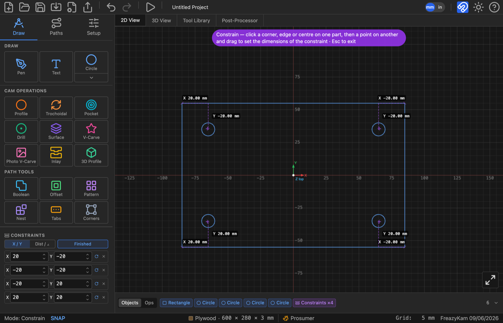

# Keep a part a set distance from another

A **constraint** holds a part in place relative to another, even when you resize or turn
the first. Example: four holes that stay 10 mm in from a plate's corners.

## Add one

1. Press **C**.
2. Hover a part. Snap points appear. The one you'd pick turns amber.
3. Click a point on the first part.
4. Click a point on the second part.
5. Type the distance you want in the **X** and **Y** boxes.
6. Press **Esc** twice when done.

Nothing moves when you create it. It holds the current distance until you type a new one.

## Hold a part off the stock edge

1. Select one part.
2. In **Constraints**, click **Left**, **Right**, **Bottom** or **Top**.

## Edit or remove

| To | Do |
|---|---|
| Change the distance | Type in the row |
| Free one direction | Click the **X** or **Y** label |
| Let it turn with the first part | Click **↻** |
| Delete | Click **✕** (nothing moves) |

## Rows turned red?

Two constraints are fighting. Delete one. See [Over-constrained](../reference/messages.md#over-constrained).
