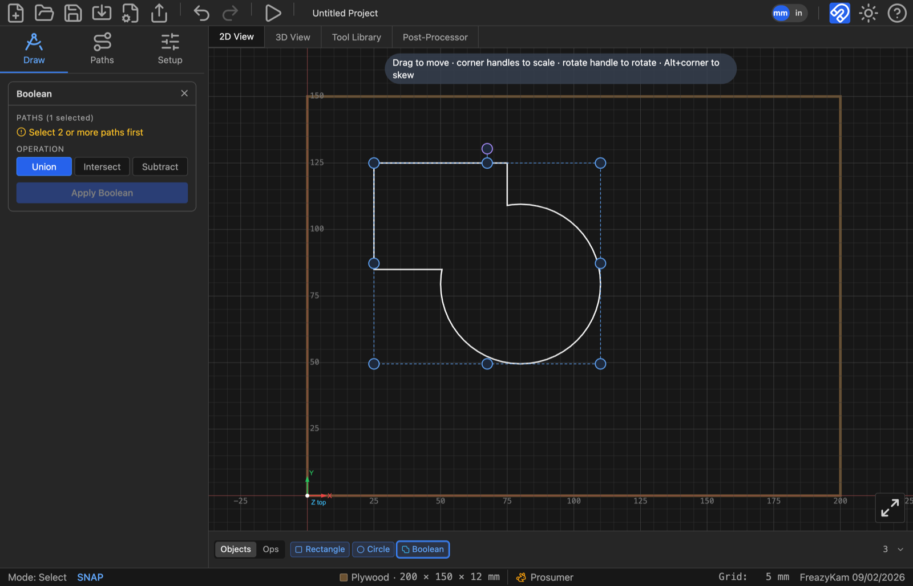
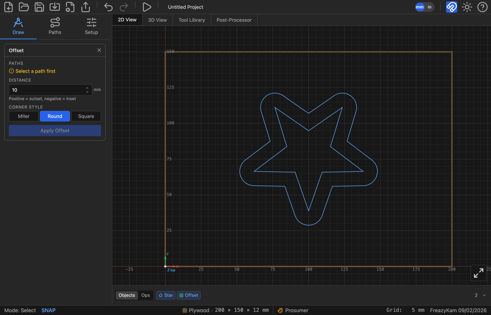
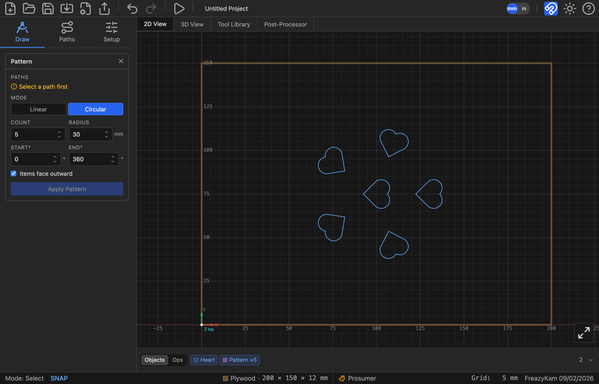
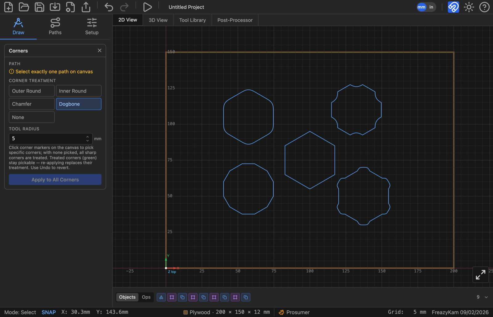

# Combine, offset, pattern and round shapes

These are under **Path Tools** in the Draw tab. They change shapes; they don't cut.
Click the result's chip in the Objects strip to change the settings later.

---

## Combine shapes (Boolean)

1. Click the shape to **keep** first, then Shift-click the others.
2. Click **Boolean**.
3. Under **Operation**, pick **union**, **intersect** or **subtract**.
4. Click **Apply Boolean**.

For Subtract, the first shape you clicked is kept. The originals are hidden, not deleted.

---

## Grow or shrink a shape (Offset)

1. Select one or more shapes.
2. Click **Offset**.
3. Type a **Distance**: positive grows, negative shrinks.
4. Pick a **Corner Style**: **miter**, **round** or **square**.
5. Click **Apply Offset**.

A rectangle, circle, star or other basic shape stays that shape with new settings. Tick
**Keep shape** to offset any other outline by scaling it to an average gap.

---

## Repeat a shape (Pattern)

1. Select one shape or group.
2. Click **Pattern**.
3. Pick a **Mode**:
   - **linear:** set **Rows**, **Cols**, and the **X Gap** and **Y Gap** between copies.
   - **circular:** set **Count**, **Radius**, **Start°** and **End°**. Tick **Rotate items**
     to turn each copy to face outward.
4. Click **Apply Pattern**.

---

## Round, chamfer or dogbone corners (Corners)

1. Select one shape.
2. Click **Corners**.
3. Under **Corner Treatment**, pick **Outer Round**, **Inner Round**, **Chamfer** or
   **Dogbone**.
4. Set the **Radius**.
5. Click corner markers on the canvas to pick corners, or pick none to treat them all.
6. Click **Apply to All Corners** (or **Apply to N Selected Corners**).

**Dogbone** lets a square part fit a pocket cut by a round bit. Its field is **Tool Radius**:
enter your bit's radius. **None** removes a treatment.

**Related:** [Add holding tabs](add-holding-tabs.md) · [Nest parts](nest-parts.md)
