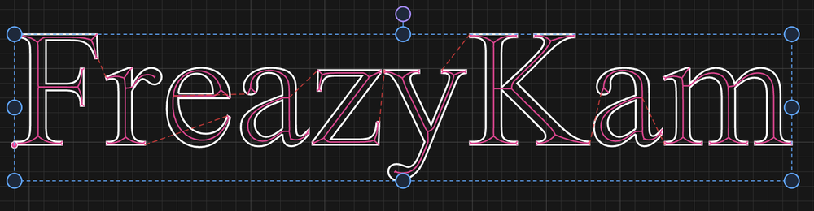
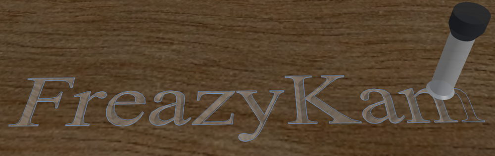

# V-carve lettering

V-carving makes letters look hand-carved, with sharp corners and pointed serifs.

1. Add your text with **Text** in the Draw tab, or import it.
2. Select the letters.
3. Under **CAM Operations**, click **V-Carve**.
4. Pick a **V-bit** or **taper** (best for very fine letters).
5. Set **Max Depth**. Read the line under it: it says the widest cut at that depth.
6. Click **Generate Toolpath**.

## Letters look flat-bottomed?

The cut hit **Max Depth**. Raise it.

## "Could not compute V-Carve"?

A letter is open or crosses itself. Try another font, or merge letters with
[Boolean → Union](use-path-tools.md#combine-shapes-boolean).

**Related:** [How V-carving works](../explanation/v-carving.md)
