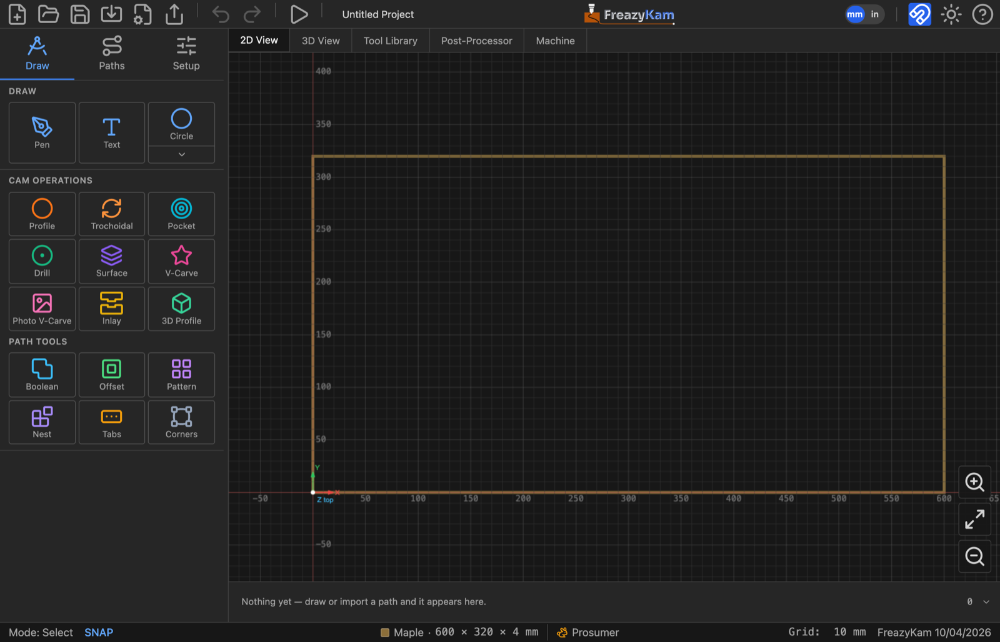
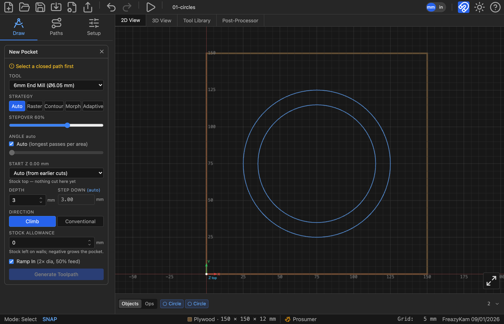
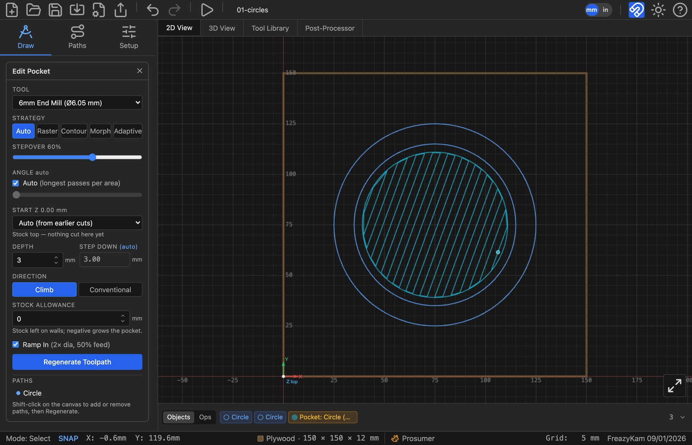
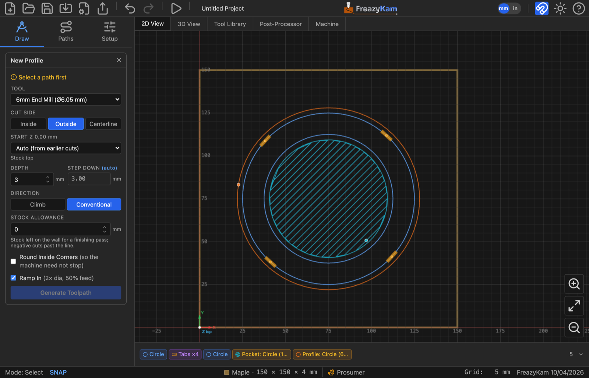
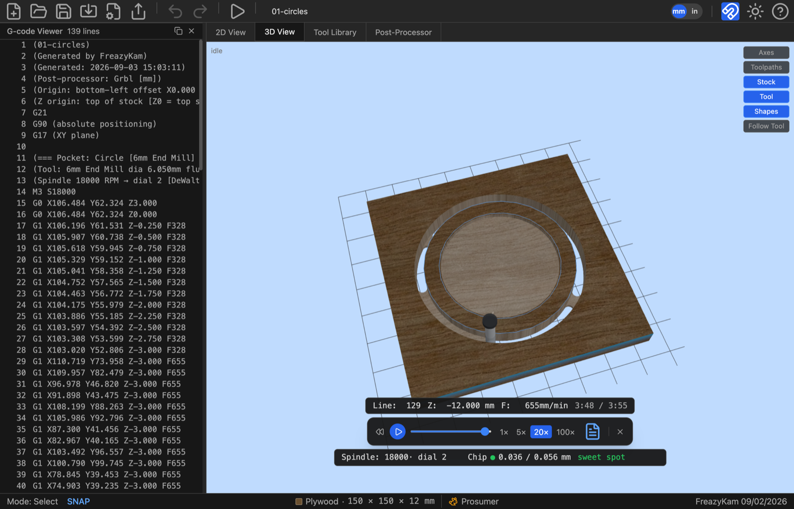

# Make your first part

You will make a **coaster**: a 100 mm disc with a 3 mm recess, held by tabs so it can't
fly loose. It takes about 10 minutes.

> **Stuck?** The finished project is [`01-circles.fkam`](../../docs/01-circles.fkam).
> Open it with the toolbar's **Open** button to compare.

---

## 1. Set the stock

1. Click the **Setup** tab in the left sidebar.
2. Type these values:

   | Field | Value |
   |---|---|
   | Width (X) | `150` |
   | Height (Y) | `150` |
   | Thickness (Z) | `12` |

3. Leave **Work Origin** on bottom-left and **Z Origin** on **Top of stock**.
4. Pick your wood under **Material**.
5. Click **×** to close the panel.

---

## 2. Draw two circles

1. Click the **Draw** tab.
2. Click the **shape button**. If it doesn't say Circle, click the arrow under it and pick
   **Circle**.
3. Set **Diameter** to `100`.
4. Click once in the middle of the stock.
5. Change **Diameter** to `80`.
6. Click on **the same spot** again.
7. Press **Esc**.

You now have two circles, one inside the other.

---

## 3. Pocket the recess

1. Click the **inner circle**.
2. Under **CAM Operations**, click **Pocket**.
3. Set:

   | Field | Value |
   |---|---|
   | Tool | 6 mm end mill |
   | Depth | `3` |

4. Leave everything else as it is.
5. Click **Generate Toolpath**.
6. Click **×** to close the form.

---

## 4. Add tabs

1. Click the **outer circle**.
2. Under **Path Tools**, click **Tabs**.
3. Set **Count** `4`, **Length** `8`, **Height** `2`.
4. Click **Apply Tabs**.
5. Click **×**.

---

## 5. Cut it out

1. Keep the **outer circle** selected.
2. Under **CAM Operations**, click **Profile**.
3. Set:

   | Field | Value |
   |---|---|
   | Tool | 6 mm end mill |
   | Cut Side | **outside** |
   | Depth | `12.5` |

4. Click **Generate Toolpath**.
5. Click **×**.

You'll see four gaps in the outline. Those are the tabs.

---

## 6. Check the order

1. Click the **Paths** tab, then **Toolpaths**.
2. Make sure **Pocket** is above **Profile**. If not, drag it up.

---

## 7. Watch it cut

1. Click **Simulate G-code** in the toolbar.
2. Click the **3D View** tab.
3. Press **Play**.

Close the player with **×** when you're done.

---

## 8. Export

1. Click **Export G-code** in the toolbar.
2. Read the review. Check the origin lines match how you'll zero the machine.
3. Click **Export**.

The `.gcode` file is in your downloads folder.

---

## 9. Save

Press **Ctrl+S** and name the file. This `.fkam` file keeps everything, so you can edit it
later.

---

## Done

You've used the five steps every job follows:

1. Set the stock
2. Draw
3. Select, pick an operation, generate
4. Check the order and simulate
5. Export

**Next:** [Carve a picture in 3D](02-carve-a-picture.md), or browse the
[how-to guides](../README.md#how-to-guides).

**Want to know why?**
- [Why "outside"?](../explanation/cut-side.md)
- [Why 12.5 mm deep on 12 mm stock?](../explanation/zero-and-depth.md)
- [Why pocket before profile?](../explanation/operations.md)
