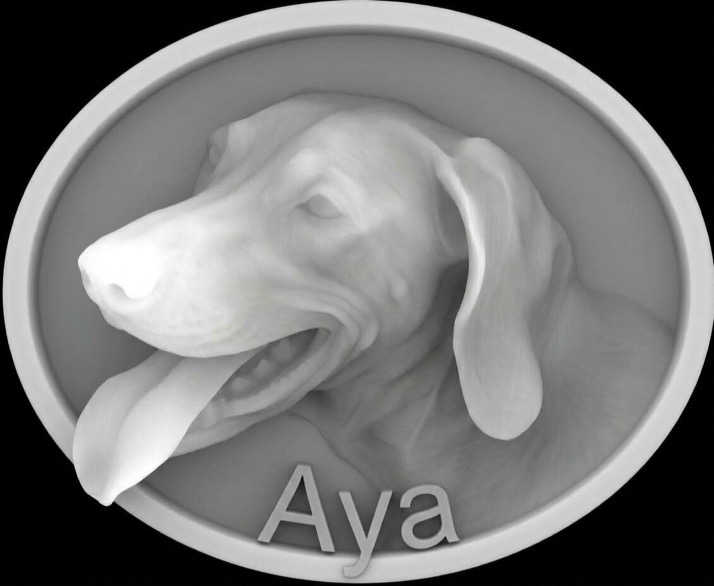

# Carve a picture in 3D

You will carve a relief plaque from a **depth map**: a greyscale picture where white is
high and black is low. Allow 15 minutes, plus simulation time.

**You need:** a depth map image (PNG is best), a 6 mm end mill and a 1/8" ball nose in your
tool library.

---

## 1. Set the stock

1. Click **Setup**.
2. Make the stock bigger than your picture, and at least 15 mm thick.
3. Close the panel.

## 2. Import the picture

1. Click **Import File** in the toolbar.
2. Pick your image.
3. Drag a corner handle to size it on the stock. Drag the picture to move it.

## 3. Draw a boundary

1. Draw an **Ellipse** (or any closed shape) around the whole picture.
2. Press **Esc**.

## 4. Set up the 3D carve

1. Under **CAM Operations**, click **3D Profile**.
2. Set:

   | Field | Value |
   |---|---|
   | Model | your picture (listed under *Depth map image*) |
   | Relief Depth | `12` |
   | Boundary | the ellipse |
   | Model Top Below Stock | `0.2` |
   | Roughing Tool | 6 mm end mill |
   | Roughing Stepover | `60` % |
   | Finishing Tool | 1/8" ball nose |
   | Finishing Stepover (XY) | `20` % |
   | Angle | `45` |

3. Read the line under **Relief Depth**. It ends with *Background: grey … and below*: those
   greys are cut flat as the floor.
4. Click **Generate Toolpath**. This can take a little while.

## 5. Simulate

1. Click **Simulate G-code**.
2. Click **3D View**.
3. Press **Play**.

## 6. Export

1. Click **Export G-code**.
2. Check the **estimated run time**. 3D jobs are long.
3. Tick **Split into one file per tool**, so you change bits between files.
4. Click **Export**.

---

## Done

**Next:** [Run your first job on the machine](03-first-cut.md)

**Want to know why?**
- [Why rough with an end mill first?](../explanation/3d-carving.md#roughing)
- [How the background is found](../explanation/3d-carving.md#depth-maps)
- [Settings for a 3D model (STL) instead](../how-to/carve-a-3d-model.md)
