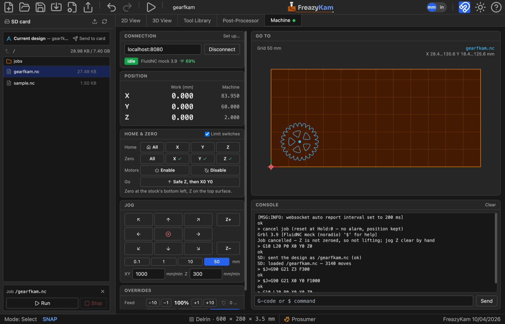

# Run your first job on the machine

You will connect to a **FluidNC** controller over WiFi, zero the machine, and cut the
coaster from [the first tutorial](01-first-part.md).

**You need:** a FluidNC controller on your WiFi, and the coaster project open. Allow 20
minutes the first time; most of that is the one-time setup in step 1.

> **Safety:** keep a way to cut power to the machine and router within reach. The app's
> STOP button needs WiFi to work.

---

## 1. Install the relay (first time only)

Follow [Install the relay file](../how-to/install-the-relay.md), then come back here.

## 2. Connect

1. Click the **Machine** tab.
2. Type `fluidnc.local` (or the controller's IP address).
3. Click **Connect**.
4. A small **FreazyKam link** window opens. Leave it open.

The state should read **Idle**.

## 3. Home

Skip this if your machine has no limit switches.

1. Under **Home & Zero**, click **Home → All**.
2. Wait for the state to return to **Idle**.

## 4. Zero on the stock

1. Fit the 6 mm end mill.
2. Use the **jog arrows** to move the bit over the stock's **bottom-left corner**.
3. Click **Zero → X** and **Zero → Y**.
4. Jog **Z−** until the bit just touches the top of the stock. Use a small step near the
   surface.
5. Click **Zero → Z**.

All three axes should show a **✓**.

## 5. Send the job

1. In the sidebar, click **Send to card**.
2. Check the map: the job should sit inside the stock.

## 6. Run

1. Start the router.
2. Click **Run**.

**To stop:** click **Pause**, wait, then **Cancel job**. In an emergency, click the red
**STOP**.

## 7. Finish

1. When the job ends, cut the four tabs with a chisel.
2. Sand the edges.

---

## Done

You've cut your first part.

**Learn more:**
- [Find Z with a touch plate](../how-to/probe-z.md) instead of by eye
- [Turn the map to match where you sit](../how-to/rotate-the-map.md)
- [All Machine tab controls](../reference/machine-tab.md)
